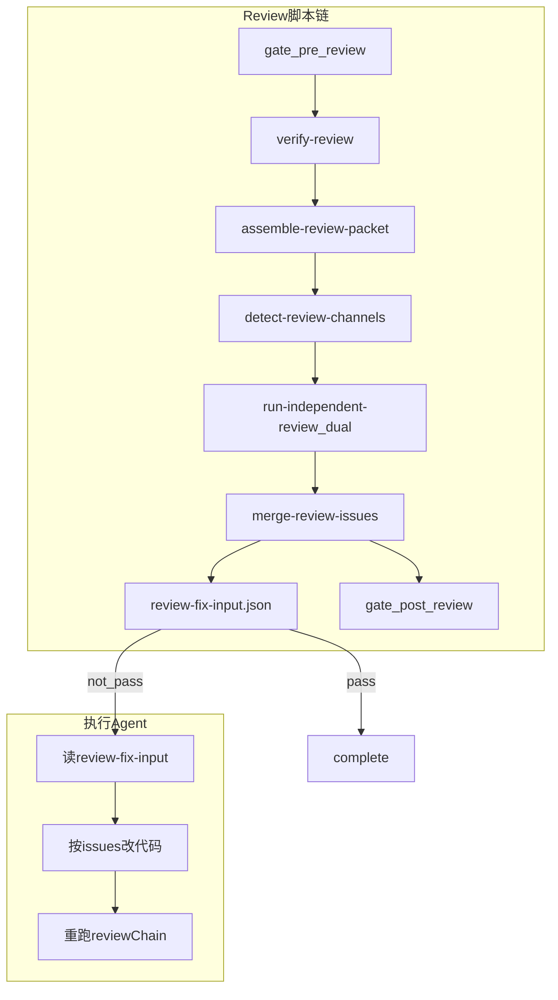

# Goal Review 执行契约与独立审核收敛计划

> **归档路径（实施后写入）**: [`docs/exec-plans/active/2026-06-review-execution-contract.md`](/Users/xuwei/Profession/goal/docs/exec-plans/active/2026-06-review-execution-contract.md)
>
> **基线分支**: `enhance/pipeline-stage-driver`（M1 改动已在工作区，未提交）
>
> **触发背景**: xrk CTB-43564 暴露 smoke/review 可跳过、review 可伪造；后续会诊明确执行 Agent 只需**明确、单一**审核产物驱动 fix loop。

---

## 目标（一句话）

独立审核模型统一产出双通道结果；**merge 脚本生成 `review-fix-input.json` 作为执行 Agent 唯一必读契约**；gate/advance/Stop Hook 保证 fix→重审 loop 不可跳过。

---

## 架构总览



---

## 产物分层（收敛后）

| 层级 | 文件 | 消费者 | 执行Agent是否必读 |
|------|------|--------|-------------------|
| **执行契约** | `evidence/review-fix-input.json` | 执行 Agent | **是（唯一）** |
| 防伪 | `evidence/review-run.json` | gate / 后台 | 否 |
| 通道原始 | `evidence/review-goal.json`, `evidence/review-gf.json` | merge 输入 / 统计 | 否 |
| 人读 | `evidence/review.md` | gate schema / 人 | 否 |
| 审计 | `evidence/review-transcript.md` | 后台（可选） | 否 |
| 门禁 | `handoff/review.json` | advance / state | 否 |

### `review-fix-input.json` Schema（v1）

```json
{
  "schema_version": 1,
  "round": 1,
  "merged_result": "pass | not_pass",
  "action": "proceed_complete | fix_and_rerun_review | mini_replan | blocked_user_decision",
  "issues": [
    {
      "id": "G01",
      "channel": "goal | guazi-flow-review",
      "severity": "blocker | warning",
      "file": "optional",
      "line_range": "optional",
      "summary": "...",
      "suggestion": "...",
      "root_cause": "implement_error | plan_gap | spec_ambiguity"
    }
  ],
  "resolved_since_last_round": [],
  "next_steps": ["..."],
  "provenance": {
    "review_run_id": "...",
    "packet_hash": "...",
    "gf_skill_attested": true
  }
}
```

`action` 由 merge 脚本根据 `auto-continue-policy` 规则**确定性**计算，执行 Agent 不自行推断。

---

## Phase M1：可观测性信任根（收尾提交）

**现状**: 工作区已有未提交改动，见 [`goal-pipeline/scripts/gate-guazi-flow-stage.sh`](/Users/xuwei/Profession/goal/goal-pipeline/scripts/gate-guazi-flow-stage.sh)、[`runtime-smoke.sh`](/Users/xuwei/Profession/goal/goal-pipeline/scripts/runtime-smoke.sh)、[`run-independent-review.sh`](/Users/xuwei/Profession/goal/goal-pipeline/scripts/run-independent-review.sh) 等。

**任务**:

1. 运行 `bash goal-pipeline/scripts/fixtures/guazi-flow-gate/run-all-gate-tests.sh` 全绿
2. 提交 M1：`feat: goal pipeline observability trust root (smoke/review gate, provenance)`
3. `install.sh` 同步到 `~/.goal-state/scripts/` 验证

**验收**: 无 `review-run.json` 时 `gate --post review` FAIL；smoke macOS duration 合法；`issues_gf_count` 不数表格行。

---

## Phase M2：执行契约 `review-fix-input.json`

### M2.1 新增 schema

- 新建 [`goal-pipeline/references/guazi-flow-artifact-schema/review-fix-input-schema.json`](/Users/xuwei/Profession/goal/goal-pipeline/references/guazi-flow-artifact-schema/review-fix-input-schema.json)

### M2.2 扩展 merge 脚本

修改 [`goal-pipeline/scripts/merge-review-issues.sh`](/Users/xuwei/Profession/goal/goal-pipeline/scripts/merge-review-issues.sh)：

- 输入：`review-goal.json`、`review-gf.json`（或从独立审核 dual 输出）、上一轮 `review-fix-input.json`（若存在，用于 `resolved_since_last_round`）
- 输出：
  - 现有 `review.md` annex / `review-gf.json` / `review-transcript.md`（保留给 gate/后台）
  - **新增** `evidence/review-fix-input.json`
- 实现 `compute_action()`：基于 issues 根因分布 + `auto-continue-policy` 映射到 4 种 `action`

### M2.3 更新 SKILL（执行 Agent 只读契约）

| 文件 | 变更 |
|------|------|
| [`goal-pipeline/SKILL.md`](/Users/xuwei/Profession/goal/goal-pipeline/SKILL.md) | 修复子循环：**MUST 只读** `review-fix-input.json`；禁止直接解析 `review-goal`/`review-gf`/`review.md` 做分流 |
| [`guazi-flow-goal/SKILL.md`](/Users/xuwei/Profession/goal/guazi-flow-goal/SKILL.md) | NEVER 手改 review 产物；修复前 MUST Read `review-fix-input.json` |
| [`guazi-flow-goal/references/stage-script-matrix.md`](/Users/xuwei/Profession/goal/guazi-flow-goal/references/stage-script-matrix.md) | review 行增加 `review-fix-input.json` |

### M2.4 gate 校验

修改 [`gate-guazi-flow-stage.sh`](/Users/xuwei/Profession/goal/goal-pipeline/scripts/gate-guazi-flow-stage.sh) `--post review`：

- 必须存在 `review-fix-input.json`
- `merged_result` 与 `review.md` frontmatter 一致
- `action=proceed_complete` 仅当 `merged_result=pass`

### M2.5 Fixture

- 新增 `fixtures/guazi-flow-gate/review-fix-input-good/` 与 `review-fix-input-not-pass/`
- 扩展 [`run-gate-tests.sh`](/Users/xuwei/Profession/goal/goal-pipeline/scripts/fixtures/guazi-flow-gate/run-gate-tests.sh)

---

## Phase M3：独立审核双通道 + 通道选择

### M3.1 packet 含双 rubric

修改 [`assemble-review-packet.sh`](/Users/xuwei/Profession/goal/goal-pipeline/scripts/assemble-review-packet.sh)：

- 增加 `guazi_flow_rubric`：从 `index.md` 验收矩阵/伪代码 + guazi-flow-review SKILL 摘要（hash 记入 packet）
- 增加 `goal_checklist`：对齐 `separation-strategies.md` Evaluator Checklist
- 增加 `smoke_diagnostic`（已有则保留）

### M3.2 接通 detect-review-channels

修改 [`run-independent-review.sh`](/Users/xuwei/Profession/goal/goal-pipeline/scripts/run-independent-review.sh)：

- 默认调用 `detect-review-channels --json`（读 `state.review_config` 或 env）
- 移除默认 `deterministic` 作为 guazi-flow 模式正常路径；保留 `--provider deterministic` 仅供 CI fixture
- dual-channel 模式：`--mode dual` 一次或两次 API 调用，产出 `review-goal.json` + `review-gf.json`（含 `skill: guazi-flow-review`, `gf_skill_attested: true`）

### M3.3 实现 platform-review-adapter

修改 [`platform-review-adapter.sh`](/Users/xuwei/Profession/goal/goal-pipeline/scripts/platform-review-adapter.sh)：

- `openai` / `anthropic` / `deepseek` / `gemini`：读 `~/.goal-state/config.json` api_keys，HTTP 调 flash 模型
- `ollama`：本地调用
- `cursor-task`：保留 stub，文档说明需 `GOAL_REVIEW_CURSOR_TASK=1`
- Prompt 使用 [`review-packet-prompt.md`](/Users/xuwei/Profession/goal/goal-pipeline/references/review-packet-prompt.md)，输出 dual JSON

### M3.4 更新 bridge 文档

- [`guazi-flow-goal/references/guazi-flow-integration.md`](/Users/xuwei/Profession/goal/guazi-flow-goal/references/guazi-flow-integration.md)：删除「Step 1.5 执行 Agent 加载 guazi-flow-review」；改为「独立审核 dual-channel 等价 gf rubric」
- [`bridge-contract.md`](/Users/xuwei/Profession/goal/guazi-flow-goal/references/bridge-contract.md)：统计口径 `gf_skill_attested` + `review-run.channels`

### M3.5 统计字段

`handoff/review.json` 扩展（向后兼容）：

```json
{
  "gf_execution_mode": "independent_dual_channel",
  "gf_skill_attested": true,
  "review_run_id": "..."
}
```

`state.json` `guazi_flow_stages.review` 同步写入。

---

## Phase M4：Fix Loop 闭环验证

### M4.1 advance-stage 对齐

[`goal-advance-stage.sh`](/Users/xuwei/Profession/goal/goal-pipeline/scripts/goal-advance-stage.sh)：

- `review_not_pass` 时 `required_commands` 指向读 `review-fix-input.json` 的 `next_steps`

### M4.2 validate-pipeline-chain

[`validate-pipeline-chain.py`](/Users/xuwei/Profession/goal/goal-pipeline/scripts/validate-pipeline-chain.py)：

- review 阶段必须存在 `review-fix-input.json`
- `action` 与 `merged_result` 一致性

### M4.3 CTB-43564 replay（xrk）

对 [`docs/guazi-flow/ctb-43564-entity-consign-recheck-post/`](/Users/xuwei/Guazi/xrk/docs/guazi-flow/ctb-43564-entity-consign-recheck-post/)：

1. 重跑 smoke → gate smoke
2. assemble → run-independent-review → merge → gate review
3. 验证旧手填 `review-goal.json` 被新链路替换
4. 若有 issues，演示一轮 fix → 重审 loop

---

## 实施顺序与依赖


| 阶段 | 预估 | 关键产出 |
|------|------|----------|
| M1 | 0.5d | commit + install 验证 |
| M2 | 1d | review-fix-input + gate + SKILL |
| M3 | 1.5d | adapter API + dual-channel + packet |
| M4 | 0.5d | fixtures + CTB replay |

---

## 风险与决策

| 风险 | 缓解 |
|------|------|
| 后台只认「Agent 加载 guazi-flow-review SKILL」 | `review-run.gf_rubric_source` + `gf_skill_attested` 过渡字段 |
| API key 不可用 | `detect-review-channels` 引导 + `action=blocked_user_decision` |
| 产物迁移破坏旧 task | gate 仅对新 `--post review` 强制 fix-input；旧目录需 replay |

---

## 归档说明

计划确认后，将本文完整写入：

```
/Users/xuwei/Profession/goal/docs/exec-plans/active/2026-06-review-execution-contract.md
```

并新增索引条目于 [`README.md`](/Users/xuwei/Profession/goal/README.md) 或 `docs/exec-plans/INDEX.md`（若不存在则创建）。

完成后将 M1–M4 实施记录追加到同文件 `## 实施记录` 节或移至 `docs/exec-plans/completed/`。
