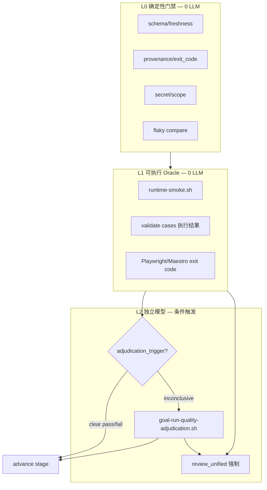
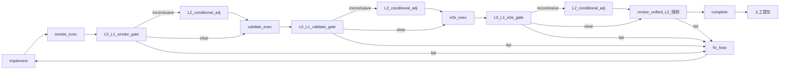
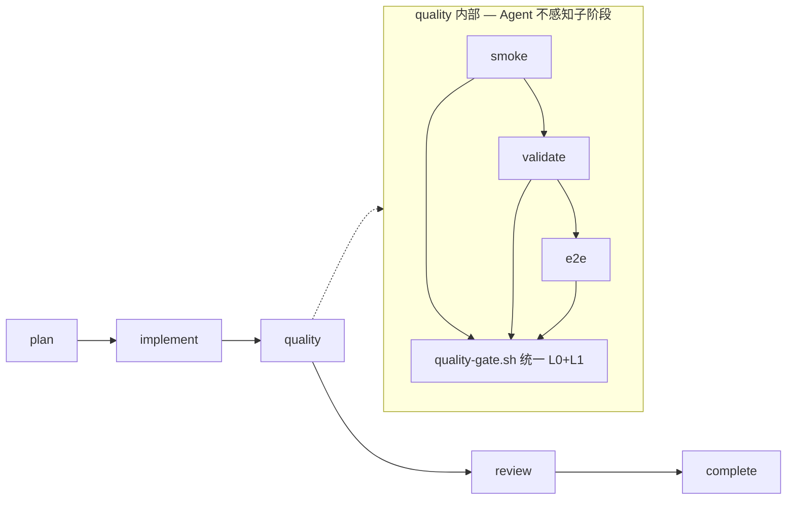
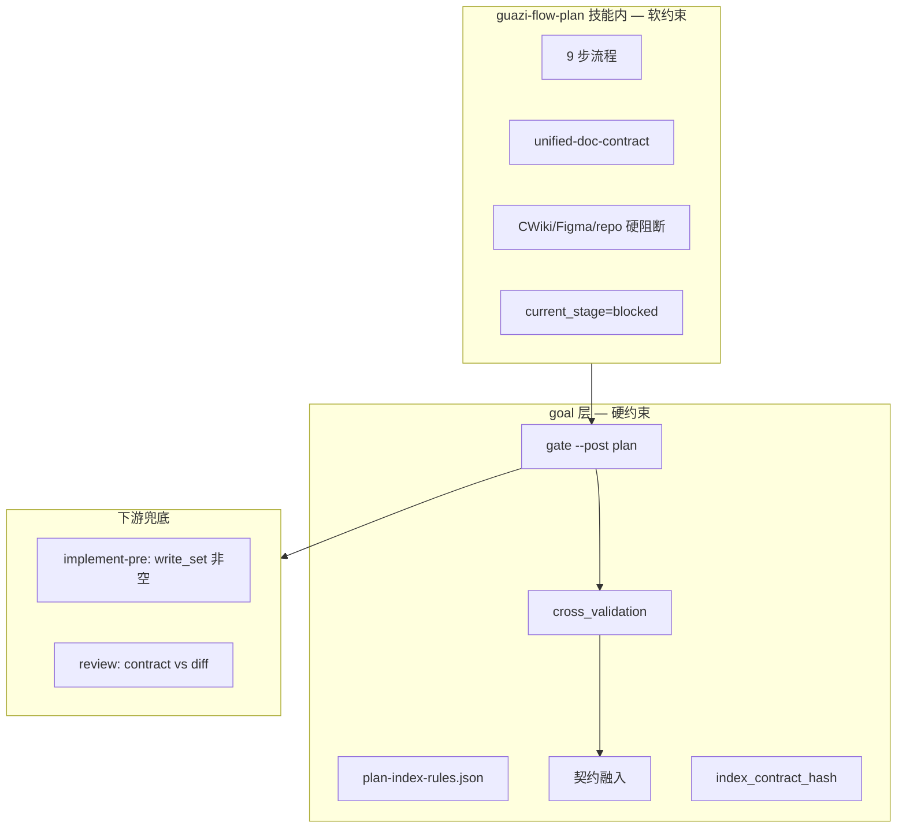
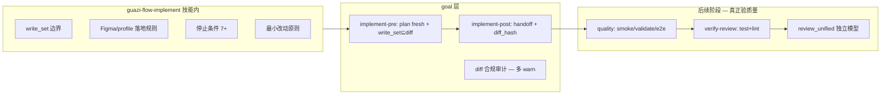
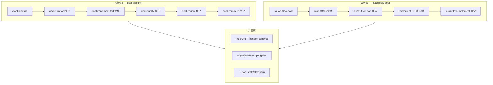

# 全链路高质量交付工作流 — 双轨架构优化计划（v4）

> **状态**: draft（仅存档，未开始实现）  
> **归档日期**: 2026-07-10  
> **来源**: Cursor Plan 会话（零溢出交付工作流优化）  
> **约束摘要**: 不修改 `guazi-flow-*` 原 skill；`goal-pipeline` Fork-and-Own 进化；`guazi-flow-goal` 兼容轨 + plan/implement 质检防火墙；不做 CI/CD 自动化。

---

```yaml
# plan-metadata（非执行配置）
name: 零溢出交付工作流优化
overview: "双轨架构 v4：goal-pipeline 演进为原生优化全链路（Fork-and-Own 自 guazi-flow-* 蓝本）；guazi-flow-goal 保持严格执行原 guazi-flow-* + plan/implement 质检防火墙。共享产物契约与 gate 脚本，不做 CI/CD。"
todos:
  - id: p0-arch-foundation
    content: "P0: 双轨契约 — fork-manifest、共享 artifact schema、goal-pipeline/stages/ 目录骨架"
    status: pending
  - id: p0-goal-plan
    content: "P0: fork goal-plan（自 guazi-flow-plan）+ 语义门禁内嵌 + gate 对齐"
    status: pending
  - id: p0-qc-firewall
    content: "P0: guazi-flow-goal plan/implement 质检防火墙（复用同一套 plan-quality-gate / implement-qc 脚本）"
    status: pending
  - id: p0-lean-quality
    content: "P0: goal-quality 单阶段 + quality-gate.sh（goal-pipeline 原生节点）"
    status: pending
  - id: p1-goal-implement
    content: "P1: fork goal-implement + implement-verify 内嵌（test/lint 反馈前移）"
    status: pending
  - id: p1-goal-review-complete
    content: "P1: goal-review/goal-complete 优化 fork；guazi-flow-goal 仅注入 review 1.5"
    status: pending
  - id: p2-sync-policy
    content: "P2: fork 与 guazi-flow-* 上游 diff 同步策略 + metrics 校准"
    status: pending
status: draft
```

---

# 正文（v4 双轨架构）

## 用户方案摘要（v4）

| 组件 | 定位 | 与 guazi-flow-* 关系 |
|------|------|---------------------|
| **goal-pipeline** | 全链路**进化版**编排；每环节可采用最佳设计 | **Fork-and-Own**：copy 蓝本 → `goal-pipeline/stages/*` 优化，**不修改**原 skill |
| **guazi-flow-goal** | 瓜子工程**兼容路径**；严格执行原 guazi-flow-* | **黑盒调用** + **plan/implement 质检防火墙**，防问题后向溢出 |

---

## 零、方法论说明

本计划 **不以用户单点意见直接驱动设计**，而是对照行业实践做客观取舍，再映射到现有 goal/guazi-flow 体系。

| 用户诉求 | 客观转译 | 行业常见解法 |
|----------|----------|--------------|
| 执行者不能自评通过 | 防确认偏误 | 机器证据 + 状态机门禁 + 代码审查分离 |
| 质量链要更可信 | 提高上线前检出率 | 测试金字塔 + 确定性门禁 + 一次独立 Code Review |
| 独立模型优先 | 审核独立性 | **仅在需要主观判断处**用独立 LLM，而非重复裁决已确定的测试结果 |

---

## 一、行业实践对照与客观结论

### 1.1 相关行业模式

**A. 质量门禁金字塔（Google CI/CD、DORA、Trunk-Based）**

```text
快/确定性 ──────────────────────────────► 慢/主观
lint → unit test → contract → smoke → e2e → code review
         ↑ 框架断言 pass/fail          ↑ 人/LLM 审 diff
```

- 测试阶段的「裁判」是 **测试框架与断言**，不是第二个审查者。
- Code Review 发生在 **实现完成后一次**，审 diff + 测试是否充分，而非逐份日志再审。

**B. LLM-as-Judge（生产实践与论文共识）**

适用：**开放式 rubric** — 代码质量、安全、需求符合度、架构风险、证据不足时的残余风险。

不适用：**重复裁决已有二进制结论** — Playwright exit 0、jest 全绿、HTTP 200。再用 LLM 读报告判 pass，带来：
- 非确定性（同证据不同结论 → flaky pipeline）
- 成本上升 3–4 倍
- 与 CI 行业惯例背离（无人用 GPT 再审 JUnit 报告）

**C. Agent 多角色（Executor/Critic）**

行业可落地形态是 **里程碑边界** 设 Critic（如实现完成、交付前），而非每个子步骤都调 Critic。原因：延迟、token、多 Judge 意见冲突。

**D. 职责分离（SOC）**

人工组织：开发写代码 → **CI 机器跑测** → 同事审代码。  
等价到 Agent 管线：

| 分离点 | 行业等价 | 本计划采纳 |
|--------|----------|-----------|
| 写代码 vs 审代码 | PR Review | **review_unified 独立 LLM（强制）** |
| 跑测试 vs 测结果 | CI runner | **L1 可执行 Oracle（脚本/Playwright）** |
| 信 agent 口述 vs 信机器 | artifacts/logs | **L0 provenance 门禁（exit_code/hash）** |

### 1.2 对「每阶段独立 LLM」的客观评估

| 方案 | 优点 | 缺点 | 行业契合度 |
|------|------|------|-----------|
| **v2：smoke/validate/e2e/review 各调独立 LLM** | 独立性最强 | 成本高、非确定性、与测试金字塔重复 | **低** |
| **v3：L0/L1 确定性 + review 强制 LLM + 条件式 LLM** | 成本可控、确定性与独立性平衡 | 需设计 inconclusive 判定 | **高** |

**结论（客观推荐 v3）**：

1. **review 阶段**：继续 **强制跨 provider 独立模型** — 与 PR Review 最佳实践一致，也是 goal-pipeline 已有优势。
2. **smoke / validate / e2e**：默认 **L0+L1 机器裁决**；Executor 只负责触发执行，**不得**根据 markdown 自填 `pass` 推进阶段。
3. **条件式 L2**：仅当 L1 输出 `inconclusive | partial | skipped | ambiguous` 时，调用独立模型做 **残余风险裁决**（非重复判 pass/fail）。

这既回应「不能让执行者自评」的核心诉求，又避免违背「测试由框架裁判」的行业惯例。

---

## 二、分层裁决模型（Tiered Adjudication Model）

### 2.1 三层定义



| 层级 | 裁判 | 成本 | 何时 |
|------|------|------|------|
| **L0** | Shell/Python gate | 零 | 每阶段 post 必跑 |
| **L1** | 测试框架/脚本 exit code + 日志解析 | 低 | smoke/validate/e2e exec 后 |
| **L2 条件** | 独立 LLM（跨 provider） | 高 | L1 无法二分决策时 |
| **L2 强制** | 独立 LLM unified review | 高 | review 阶段始终 |

### 2.2 防 Executor 自评（不靠每阶段 LLM）

行业等效做法：**信机器，不信 Agent 摘要**。

| 机制 | 实现 |
|------|------|
| 阶段推进权 | 仅 `gate --post` exit 0 + `goal-advance-stage` 可推进，Agent 输出 ✅ 无效 |
| 证据 provenance | validate/e2e/smoke 须含 `runner`/`exit_code`/`log_hash`/`git_head`（goal 层 schema 扩展） |
| 不信 frontmatter | L0 解析 `result=pass` 但必须匹配 L1 exit_code；不匹配 → `inconclusive` → 触发 L2 或 blocked |
| 修复分流 | 仅读 `*-gate-fix-input.json` / `review-fix-input.json`，与现 goal-pipeline 一致 |

### 2.3 adjudication_policy（Strategy，写入 state.json）

```json
{
  "quality_policy": {
    "validate": "required",
    "e2e": "required",
    "smoke_depth": "basic | enhanced"
  },
  "adjudication_policy": {
    "review_unified": "always_llm",
    "quality_stages": "deterministic_first",
    "llm_on": ["inconclusive", "partial", "skipped", "ambiguous", "policy_required_but_missing_evidence"],
    "llm_off": ["clear_pass", "clear_fail"]
  }
}
```

- `review_unified: always_llm` — **行业对齐，不可降级**（已有 review-channel-guard 防 deterministic-only pass）。
- `quality_stages: deterministic_first` — smoke/validate/e2e 默认 L0+L1。
- `llm_on` 列表 — 仅上述状态进入 `goal-run-quality-adjudication.sh`。

### 2.4 L1 各阶段「清晰 pass/fail」判定（客观标准）

| 阶段 | clear_pass | clear_fail | inconclusive（触发 L2） |
|------|------------|------------|-------------------------|
| smoke | HTTP 200 + 进程存活 + 无 compile error | 启动失败/非 200/编译错误 | 端口占用、超时、日志不足以分类 |
| validate | 所有 required case `pass` 且 exit 0 | 任一 required case `fail` | `manual_only`、环境不可用、case 无断言 |
| e2e | Playwright exit 0 + `run_pass` + hash fresh | exit ≠ 0 或 `run_failed` | `blocked`/`fixme`/部分模块 skip |

### 2.5 review_unified 定位（强制 L2）

与行业 PR Review 一致，packet 包含：

- candidate diff + 验收矩阵 V#
- **L0/L1 裁决记录**（非 LLM 复述，而是机器结论 + provenance）
- 条件式 L2 裁决（若有）
- guazi-flow-review 注入（黑盒，不改 skill）

独立模型此处价值最大：**实现是否符合需求、测试是否充分、证据链是否造假**。

---

## 三、约束（保持不变）

1. 只改 **guazi-flow-goal** + **goal-pipeline**（含 scripts/schemas/references）。
2. **不修改** 任何其它 guazi-flow-\* skill；validate/e2e 黑盒调度 + Bridge 契约注入。
3. **不做** commit/push/CI/CD 自动化；complete = `ready_for_production` 候选产物。

---

## 四、设计模式（证据驱动版）

| 模式 | 用途 |
|------|------|
| **Facade** | guazi-flow-goal 统一入口与阶段调度 |
| **Strategy** | `quality_policy` + `adjudication_policy` |
| **Bridge** | plan 后向 index.md 注入 validate/e2e 触发字段 |
| **Decorator** | L0 `quality-gate-*.sh` 包装黑盒 exec 产物 |
| **Template Method** | 每阶段：exec → L0 → L1 → (条件 L2) → advance |
| **Chain of Responsibility** | L0 → L1 → L2，前层 clear 则跳过 L2 |

**不采用**：每阶段 Observer 独立 LLM（v2 方案，行业契合度低）。

---

## 五、目标管线（v3）



---

## 六、分阶段实施方案

### Phase 0 — 分层裁决与门禁（P0，1–2 周）

1. **文档与策略**
   - 新增 [goal-pipeline/references/tiered-adjudication.md](../../../goal-pipeline/references/tiered-adjudication.md)（L0/L1/L2 判定表）
   - guazi-flow-goal 集成 `adjudication_policy` 访谈默认值

2. **L0/L1 门禁脚本**
   - `quality-gate-smoke.sh` / `quality-gate-validate.sh` / `quality-gate-e2e.sh`
   - 输出：`adjudication_status: clear_pass | clear_fail | inconclusive` + provenance

3. **条件式 L2**
   - `goal-run-quality-adjudication.sh`（非每阶段全量）
   - 复用 `platform-review-adapter` + `review-channel-guard`
   - 产出：`evidence/quality-adjudication-run.json`（仅 inconclusive 时存在）

4. **review 保持强制 L2**
   - 现有 `goal-run-review-chain.sh` 不改语义，仍为必经

### Phase 1 — 硬执行层（P0，2–3 周）

- `goal-advance-stage.sh` 扩展虚拟阶段（exec + gate，非 exec + llm_review 对）
- `goal-stage-driver.sh` 输出 L0/L1 mandatory_commands
- `verify.sh`：L1 clear_pass 或 L2 adjudication pass + review_unified pass
- lock/budget、stop-hook loop_limit=10
- gate fixture 路径参数化（goal 仓本地测试）

### Phase 2 — 质量深度（P1，2–3 周）

- smoke enhanced（L1 增强，仍 0 LLM）
- validate/e2e 黑盒编排（guazi-flow-goal）
- flaky 阻断（L0 确定性）
- `quality-report.md`：记录每层裁决，而非仅 LLM 表

### Phase 3 — 删除项（相对 v2）

- ~~每阶段 mandatory `*-review-run.json`~~
- ~~`goal-run-quality-review-chain` 三模式全量 LLM~~
- ~~verify 要求 3 次质量 LLM provenance~~

---

## 七、改动边界

| 可改 | 内容 |
|------|------|
| guazi-flow-goal | 分层调度、adjudication_policy、禁止 Executor 自评 |
| goal-pipeline | tiered-adjudication、quality-gate、conditional adjudication、verify |
| 不可改 | 所有其它 guazi-flow-\* |

---

## 八、成功标准（客观可验证）

| 指标 | 目标 | 度量方式 |
|------|------|----------|
| review_unified 独立模型执行率 | 100% | `review-run.json` 存在 |
| 质量阶段 L2 触发率 | 10–30%（健康区间） | 过高说明 L1 弱；过低说明 L1 漏判 |
| L1 clear 决策占比 | ≥ 70% | adjudication_status 统计 |
| Executor 无 gate 推进拦截率 | 100% | fixture 模拟违规 |
| policy=required 任务 V# P0 覆盖 | ≥ 95% | quality-report |
| 条件 L2 与 review_unified 结论冲突率 | < 5% | 流水线日志 |

**不考核**：每阶段 LLM 调用次数（非目标）。

---

## 九、风险与客观取舍

| 取舍 | 说明 |
|------|------|
| v3 vs v2 | 牺牲「每步 LLM 独立性」换取确定性与成本；核心独立审在 review，符合行业 |
| L1 漏判 | 靠增强 exit_code/provenance + review_unified 兜底，而非前置重复 LLM |
| inconclusive 阈值 | 过松 → L2 过多；过紧 → 风险漏检；需 MVP 后用触发率校准 |
| 不改 guazi-flow-\* | validate/e2e 的 `result=pass` 可能与 L1 冲突 → 以 L1+gate 为准，触发修复循环 |

---

## 十、2 周 MVP（证据验证）

1. 实现 L0/L1 quality-gate（smoke + validate）
2. 实现 conditional `goal-run-quality-adjudication.sh`
3. 跑 2 个 h5 任务，记录：L1 clear 率、L2 触发率、review 检出而 L1 未检出的 issue 数
4. **决策门**：若 review 检出率显著高于 v2 预期节省的 L2 成本，维持 v3；若 L1 漏检严重，增强 L1 规则而非默认每阶段 LLM

此 MVP 用数据验证分层模型，而非预设「用户说什么就做什么」。

---

## 十一、自检流程质量保证体系

> 问题：如何保证 smoke / validate / e2e / L0-L2 gate / review 等**自检**本身高质量，而不是「跑过场」？

行业共识：**自检质量 ≠ 多跑几次**，而是 **输入可信 + Oracle 强 + 防作弊 + 可校准 + 可追溯 + 元审查兜底**。

### 11.1 六要素框架（客观标准）

```mermaid
flowchart LR
  subgraph inputs [1 输入质量]
    V[V# 验收矩阵]
    WS[write_set]
    Cases[case 可执行性]
  end

  subgraph oracle [2 Oracle 强度]
    Assert[断言/exit_code]
    Contract[契约校验]
    MatrixMap[case↔V# 映射]
  end

  subgraph anti [3 反作弊]
    Prov[provenance]
    Fresh[freshness hash]
    NoSelf[禁止 Executor 自评]
  end

  subgraph cal [4 校准]
    Fixture[gate 负例 fixture]
    Golden[golden fail 样本]
    Rate[触发率/漏检率]
  end

  subgraph trace [5 追溯]
    Chain[V#→case→evidence]
    Report[quality-report]
  end

  subgraph meta [6 元审查]
    Review[review_unified]
    Suff[测试充分性 rubric]
  end

  inputs --> oracle --> anti --> cal --> trace --> meta
```



| 要素 | 回答的问题 | 落地位置（只改 goal 层） |
|------|-----------|------------------------|
| **输入质量** | 测的是不是对的东西？ | plan/Bridge：V# 可测性门槛；validate/e2e case 必须映射 V# |
| **Oracle 强度** | 判定是否客观、可重复？ | L1：exit_code + 结构化日志解析，禁止纯 markdown 自填 |
| **反作弊** | Agent 能否伪造通过？ | L0：provenance、hash、scope/secret；gate 推进权 |
| **校准** | 门禁本身是否测过？ | goal 仓 fixture：pass + **故意 fail** 负例 |
| **追溯** | 漏了哪条验收能定位？ | quality-report：V#↔case↔evidence 三角表 |
| **元审查** | 自检覆盖够不够？ | review_unified rubric：**测试充分性** 独立审 |

### 11.2 分流程高质量保证（具体措施）

#### A. plan / 验收矩阵（自检的「需求输入」）

| 高质量标准 | 机制 |
|-----------|------|
| 每条 V# 有 pass/fail 判定方式 | goal-pipeline plan 质量门槛（已有）；Bridge 交叉验证 |
| V# 与 write_set 一致 | plan gate：提到模块必须在 Allowed Files |
| P0 V# 必须绑定验证方式 | `quality_policy`：P0 无 automated case → plan blocked 或标 `manual_only` 并计入 inconclusive |

**反模式拦截**：「功能正常」「无明显问题」类不可测 V# — plan gate 拒绝。

#### B. smoke（L0+L1）

| 高质量标准 | 机制 |
|-----------|------|
| 不只探活 | `smoke_depth=enhanced`：关键 API + console error（h5） |
| 结论可复现 | `runtime-smoke.md` 扩展 provenance：`command`、`exit_code`、`http_status`、`duration_ms`、`log_hash` |
| 环境 vs 代码可区分 | L1 输出 `classification: environmental \| code_issue \| runtime_crash`；environmental 不阻断但写入 review packet |
| Oracle 可校准 | fixture：`smoke-good`（已有）+ **`smoke-fake-pass`**（markdown 写 pass 但 exit≠0 必须 gate fail） |

#### C. validate（黑盒 exec + L0+L1）

| 高质量标准 | 机制 |
|-----------|------|
| case 来自验收矩阵，非凭空编造 | Bridge 注入；L0 检查 validate.md 每条 case 有 `source:V#n` |
| case 必须可执行 | 禁止 `manual_only` 作为 required P0 的唯一验证；否则 inconclusive→L2 或 blocked |
| 不信 skill 自填 pass | L0：`result=pass` 须与 case 表每行 `pass` + 命令 `exit_code=0` 一致，否则 `provenance_mismatch` |
| Oracle 强度 | 契约类任务：swagger/ajv 命令作为 L1 case（guazi-flow-validate 已支持，goal 层 **required 时 gate 强制存在**） |
| 覆盖度 | L1 统计：`required_cases_pass / required_cases_total`；<100% → clear_fail |

#### D. e2e（黑盒 exec + L0+L1）

| 高质量标准 | 机制 |
|-----------|------|
| spec 与 case 契约一致 | L0：case 文件 hash 与 spec 引用一致（guazi-flow-e2e 原则，goal gate 只读校验路径存在） |
| 不信自愈结论 | L1 以 **Playwright exit code + run-report 结构化字段** 为准，不以 Agent 摘要为准 |
| flaky 不算 pass | L0 `quality-gate-flaky.sh`：连续两轮结果不一致 → clear_fail |
| 覆盖度 | TEST-PLAN 模块 ↔ P0 V# 映射表；`fixme`/`skipped` P0 模块 → inconclusive 或 clear_fail（policy 可配） |
| 弱断言检测（元层） | review_unified rubric：检查 assert 是否仅 `toBeVisible` 而无业务状态断言 |

#### E. L0 确定性门禁（各阶段 post）

| 高质量标准 | 机制 |
|-----------|------|
| 门禁本身有测试 | [run-all-gate-tests.sh](../../../goal-pipeline/scripts/fixtures/guazi-flow-gate/run-all-gate-tests.sh) 扩展负例 |
| stale 不能过 | `subject_hash` / `candidate_diff_hash` / `git_head` 三元一致（已有 staleness 机制） |
| noop 修复不能过 | `blocked(noop_fix)` ratchet（已有） |
| secret/scope 零漏 | review-pre `verify-review.sh`（已有）；质量链 L0 同样跑 scope/secret |

#### F. L2 条件裁决 + review_unified（元审查）

| 高质量标准 | 机制 |
|-----------|------|
| L2 不重复 L1 二进制结论 | rubric 限定：仅裁决 **证据不足 / 分类模糊 / 残余风险**，不重判 exit code |
| review 强制独立 | `review-channel-guard` 防 deterministic-only（已有） |
| **测试充分性**元检查 | unified packet 增加 checklist 维度：`v_coverage`、`weak_oracle`、`missing_p0_case`、`provenance_gap` |
| 跨层一致性 | review 须引用 L0/L1 裁决记录；若 L1 clear_pass 但 diff 明显缺测试 → review not_pass |

### 11.3 反「自检走过场」清单（NEVER）

| NEVER | 原因 | 检测 |
|-------|------|------|
| 无 `exit_code` 的 pass | 可伪造 | L0 schema 必填 |
| case 无 `source:V#` | 测错范围 | L0 rg 校验 |
| P0 仅 `manual_only` | 无自动化 Oracle | plan 或 validate gate |
| stale evidence 当 fresh | 测的不是当前 diff | hash gate |
| Executor 输出 ✅ 无 gate | 自评 | `gate --assert-complete` |
| 削弱断言换 pass | 测试腐败 | review rubric + e2e 自愈轮次上限（guazi-flow-e2e 已有，goal 记录） |
| L1 clear 率 100% 且 review 常 not_pass | L1 过松 | 触发率监控 → 收紧 L1 规则 |

### 11.4 质量校准闭环（不依赖线上 CI/CD）

```text
MVP 任务跑通
  → 记录 quality-report 指标（L1 clear 率、L2 触发率、review 补检 issue 数）
  → 人工上线后（开发者自行提交）记录「自检漏检」事件（可选 wiki/quality-report 附录）
  → 每季度校准：
      L1 漏检多 → 增强 quality-gate 规则 / smoke_depth / required case
      L2 触发 >30% → L1 过弱或环境不稳，修 env defaults 而非加 LLM
      review 与 L1 常冲突 → 检查 V# 可测性或 packet 组装
```

存储：`~/.goal-state/metrics/<project_id>.json`（goal 层，非 guazi-flow）。

### 11.5 quality-report 必含「自检质量」章节

complete 时 `evidence/quality-report.md` 除 V# 覆盖外，**必须**包含：

```markdown
## 自检质量摘要
| 流程 | 裁决层 | Oracle | required/total | provenance | 结论 |
|------|--------|--------|----------------|------------|------|
| smoke | L1 | HTTP 200 + exit 0 | 3/3 | ok | clear_pass |
| validate | L1 | case exit codes | 12/12 | ok | clear_pass |
| e2e | L1+L0 flaky | Playwright exit 0 | 8/10 P0 | ok | inconclusive→L2 pass |
| review | L2 | unified rubric | 6/6 checklist | review-run.json | pass |

### 自检风险
- [ ] 无

### 元审查发现（测试充分性）
- ...
```

`ready_for_production=true` 条件之一：**所有 policy=required 的自检项均为 clear_pass 或 L2 条件裁决 pass，且无未披露 P0 gap**。

### 11.6 与 v3 分层模型的关系

| 层级 | 保证自检「高质量」的核心 |
|------|------------------------|
| L0 | 防伪造、防 stale、防 scope 漂移 — **可信性** |
| L1 | 强 Oracle（exit_code + V# 映射）— **有效性** |
| L2 条件 | 仅补 **模糊地带** — **完备性** |
| review L2 | 审 **测试是否充分** — **元质量** |

**结论**：自检高质量不靠「每步加 LLM」，而靠 **输入可追溯 + Oracle 可执行 + 门禁可校准 + review 审覆盖度** 四层叠加。

---

## 十二、复杂度评估与 Lean 默认路径

> 问题：流程是否过于复杂？复杂设计在实际执行中更易出问题、耗时更长。

### 12.1 客观复杂度评分

| 维度 | 基线（现 goal-pipeline 5 阶段） | v3 完整设计 | 风险 |
|------|-------------------------------|-------------|------|
| Agent 可见阶段数 | **5** | **8–11**（若暴露每个 exec+gate+L2） | 高 — 跳步/漏步概率上升 |
| 状态机 handoff 节点 | 5 | 10+ | 中 — chain 校验变脆 |
| 新增脚本（goal 层） | 0 | 4–6 个 | 中 — 部署/维护成本 |
| 策略配置对象 | 1（review_config） | 3（+quality_policy+adjudication_policy） | 中 — 访谈与推断负担 |
| 单任务 LLM 调用 | 1（review） | 1–4（review + 0–3 条件 L2） | 低–中 |
| h5 单任务墙钟时间（估） | 30–90 min | **60–180 min**（+validate+e2e） | 高 — 主要耗时在 e2e 非门禁 |
| 实现工期（goal 仓） | — | **3–5 周** 完整 v3 | 中 |

**综合复杂度：6.5/10（完整 v3）** — 设计合理但 **对 Agent 暴露过多子阶段时会升到 8/10**，执行故障率显著上升。

**主要耗时来源（诚实拆分）**：

```text
implement（写代码）          ~40%
e2e exec（Playwright）       ~30%  ← 与门禁设计无关，policy=required 即有
validate exec                ~15%
review 独立 LLM              ~10%
smoke + L0/L1 gate           ~5%   ← 门禁本身很轻
条件 L2（若触发）            ~5%   ← 不应默认高频
```

结论：**复杂度瓶颈是「质量执行」（尤其 e2e），不是 L0/L1 门禁**。过度暴露子阶段会增加 **编排故障** 而不显著增加质量。

### 12.2 复杂度的真正风险

| 风险 | 表现 | 行业教训 |
|------|------|----------|
| 状态机膨胀 | `wrong_stage`、handoff stale 增多 | Kubernetes 式「少阶段、强 gate」优于「多微阶段」 |
| Agent 软遵守 | 跳过 validate/e2e 直进 review | 必须 **单一 work_order**，子步骤内聚到脚本 |
| 配置组合爆炸 | quality×adjudication×profile 笛卡尔积 | 默认一种「标准档」，高级档显式开启 |
| 过早优化 | MVP 即做条件 L2 + 六要素全文 | 先 **Lean 跑通** 再按需加厚 |

### 12.3 Lean 默认路径（推荐执行形态）

**原则：Agent 只见 5 阶段；质量链内聚为一个 `quality` 阶段，由脚本串行，不扩展对外状态机。**



| 对比项 | 完整 v3（文档/design） | **Lean 默认（执行）** |
|--------|----------------------|----------------------|
| Agent 可见阶段 | 8–11 | **5（不变）** |
| 质量门禁脚本 | 3 个 + 条件 L2 | **1 个 `quality-gate.sh`** |
| 条件 L2 | inconclusive 即触发 | **MVP 延后**；inconclusive → blocked + 人工选项 |
| 策略对象 | quality + adjudication 分离 | **合并为 `quality_policy` 单对象** |
| quality-report | 完整六要素表 | **简版 checklist**；完整版 Phase 2 |
| state.json stages | 10+ 子阶段 | **5 阶段**；quality 内进度写 `quality_substeps` 日志字段 |

**Lean `quality` 阶段 Agent 协议（仅 3 行）**：

```text
1. 按 policy 黑盒调度 smoke → validate → e2e（只读 guazi-flow-*）
2. 运行 quality-gate.sh --task-dir <task>（统一 L0+L1，exit 0 才继续）
3. not_pass → 读 quality-gate-fix-input.json → fix_loop → implement
```

### 12.4 分档策略（控制复杂度的关键）

只保留 **两档**，避免组合爆炸：

| 档位 | 适用 | quality 内容 | 预估墙钟 |
|------|------|-------------|----------|
| **standard**（默认） | 多数 h5 功能/修复 | smoke + review-pre 已有 test/lint + validate（若 index 触发） | +20–40 min |
| **strict** | P0 页面/资金/核心链路 | standard + e2e required + flaky 阻断 + 简版 quality-report | +60–120 min |

- 默认 **standard**；仅当用户确认或 V# 含 UI P0 时升 **strict**。
- **不因「流程完整」默认 strict** — 这是复杂度失控的主要来源。

### 12.5 实施顺序调整（降风险）

```text
Sprint 1（Lean MVP，~1 周）
  → quality 单阶段 + quality-gate.sh（smoke + provenance）
  → 5 阶段状态机不变
  → review 保持现链

Sprint 2（+strict 能力，~1 周）
  → quality 内嵌 validate/e2e 黑盒调度
  → quality-gate 扩展 L1 validate/e2e
  → 简版 quality-report

Sprint 3（可选加厚，~1–2 周）
  → 条件 L2 adjudication（仅 inconclusive）
  → smoke enhanced、flaky、完整 quality-report
  → lock/budget、metrics 校准
```

**决策门**：Sprint 1 跑 2 个真实任务；若 5 阶段 + 单 gate 已能拦截主要问题，Sprint 3 整包 **可推迟**。

### 12.6 复杂度 ↔ 质量 平衡点（客观建议）

| 如果去掉… | 质量损失 | 复杂度收益 | 建议 |
|-----------|----------|-----------|------|
| 条件 L2 | 低（review 兜底） | 高 | **MVP 去掉** |
| e2e strict | 中（UI 回归风险） | 高 | 仅 strict 档 |
| validate | 中 | 中 | standard 保留轻量 |
| 3 个独立 quality-gate | 无 | 高 | **合并为 1** |
| review 独立 LLM | **高** | — | **绝不去掉** |
| provenance/L0 | **高** | 低 | **保留** |

**最终建议**：采用 **「设计用分层模型思考，执行用 5 阶段 Lean 路径」** 的双轨文档策略。完整 v3 逻辑作为 `quality-gate.sh` **内部实现**，不增加 Agent 认知负担。

### 12.7 修订后 todos 优先级

1. **P0**：Lean MVP — `quality` 单阶段 + 统一 `quality-gate.sh` + 5 阶段不变
2. **P0**：**plan-quality-gate** — goal 层补强 plan 语义门禁（见第十三节）
3. **P1**：strict 档 + validate/e2e 内嵌 + 简版 quality-report
4. **P2**：条件 L2、enhanced smoke、metrics 校准（按需）

---

## 十三、guazi-flow-plan 质量评估与 goal 层补强

> 问题：作为前向最关键输出的 `index.md`，质量如何保证？能否符合「高质量可上线、低溢出」要求？

**约束**：不修改 [guazi-flow-plan](~/.agents/skills/guazi-flow-plan/SKILL.md)；补强仅在 **goal 层 gate + Bridge + 交叉验证**。

### 13.1 现有保障机制（客观盘点）



| 层级 | 机制 | 强度 | 检什么 |
|------|------|:----:|--------|
| **skill** | 9 步 + 停止规则 + 完成门禁条件（15+ 条） | 中 | 语义完整、设计 DSL、多仓、mock 覆盖 |
| **skill** | `current_stage=blocked` + failure_code | 高 | CWiki 鉴权、Figma DSL、缺 repo 路径 |
| **goal gate** | `plan-index-rules.json` | **高** | 7 个必填章节、frontmatter、pseudocode≥200 字、≥1 代码块 |
| **goal gate** | `handoff/plan.json` | 高 | write_set 提取、acceptance_matrix_ids 正则 |
| **goal** | cross_validation | **低** | write_set⊆Allowed Files 仅 **warn**；V# 缺口记 plan_gap **不阻断** |
| **goal** | Bridge 契约融入 | 低 | 失败 **静默跳过** |
| **下游** | implement-pre | 高 | write_set 空 → blocked（偏晚） |
| **下游** | review_unified | 高 | diff vs 契约；plan_gap 此时才重罚 |

### 13.2 客观符合度评估

| 你的要求 | guazi-flow-plan + 现 goal gate | 符合？ | 说明 |
|----------|-------------------------------|:------:|------|
| 结构化任务契约 | index.md 7 章节 + unit.md | **是** | 行业少见的文档驱动深度 |
| write_set 可执行 | skill 要求 + implement-pre | **部分** | plan-post **不强制** write_set 非空 |
| 验收矩阵可测 | skill 要求一张表 | **部分** | gate 只检查章节存在 + ID 正则，**不检查**每行「执行方式/判定」 |
| 伪代码可指导实现 | skill 规则详尽 | **部分** | gate 仅 ≥200 字 + 1 代码块，**可灌水通过** |
| 设计还原可靠 | Figma 硬门禁 | **条件** | DSL 缺失即 blocked；用户允许降级时质量下降 |
| 前向防溢出 | plan 定边界 | **部分** | plan_gap、契约融入弱化；主要靠 **review 事后** |
| Agent 必然执行 9 步 | skill NEVER | **弱** | 软约束；靠 gate 结构校验 |

**总评：6/10 — 结构合格线高，语义合格线偏低；对「零溢出」而言，plan 是最大残余风险点之一。**

### 13.3 核心缺口（为何「能过 gate 但质量不够」）

1. **结构门禁 ≠ 语义门禁** — `## 验收与验证矩阵` 存在即可；「功能正常」类不可测条目不拦截。
2. **plan_gap 不阻断** — V# 与矩阵不一致仍进 implement（[guazi-flow-integration.md](../../../guazi-flow-goal/references/guazi-flow-integration.md) 明确 defer 到 review）。
3. **write_set 空过 plan** — 仅在 implement-pre 才 blocked，浪费一轮 implement 准备。
4. **交叉验证只 warn** — write_set 超出 Allowed Files 不阻断。
5. **契约融入静默失败** — Goal Allowed Files 未写入 index → implement  scope 漂移。
6. **同模型 plan + implement** — 无独立 spec review（行业：关键项目有，常规模块可省略；用 **严格 gate** 替代可接受）。
7. **不修改 guazi-flow-plan** — skill 内再强也依赖 Agent 读全 SKILL；**机器可验证部分必须下沉 goal gate**。

### 13.4 goal 层补强方案（不改 guazi-flow-plan）

在 `gate --post plan` 增加 **plan-quality-gate**（goal-pipeline `plan-index-rules.json` 扩展或 `plan-quality-gate.py`）：

| 规则 ID | 检查 | standard 档 | strict 档 |
|---------|------|:-----------:|:---------:|
| PQ-01 | `write_set` 非空 | **block** | block |
| PQ-02 | `acceptance_matrix_ids` 数量 ≥ 1 | block | block |
| PQ-03 | 矩阵每行含「执行方式」或「验证」列非空 | warn | **block** |
| PQ-04 | 禁止模糊措辞（功能正常/无明显问题/后续对账） | warn | **block** |
| PQ-05 | cross_validation V# 全覆盖 | warn | **block** |
| PQ-06 | `pseudocode_min_chars` | 200（现） | **500** |
| PQ-07 | Bridge 契约融入成功 | warn | **block** |
| PQ-08 | P0 `blockers` 非空 | block | block |

失败产出：`evidence/plan-gate-fix-input.json`（已有 fixture 模式），Agent 调 guazi-flow-plan **更新** index.md（黑盒），不重写 skill。

### 13.5 是否符合要求？— 补强前后对比

| 场景 | 现状 | + plan-quality-gate（P0） |
|------|------|--------------------------|
| 不可测验收进 implement | 可能 | standard warn / strict block |
| write_set 空 | implement-pre 才拦 | **plan-post 即拦** |
| plan 与 Goal 范围漂移 | warn | strict block |
| 低质量伪代码 | 200 字通过 | strict 提高阈值 |
| 整体可上线置信度 | 中 | **中高** |

**结论**：

- **仅靠 guazi-flow-plan + 现 gate**：对「有文档、能跑通」够；对「高质量低溢出」**不够**。
- **+ goal 层 plan-quality-gate（Lean，无额外 LLM）**：可在 **不增 Agent 可见阶段、不改 guazi-flow-plan** 前提下，将 plan 符合度提升到 **7.5–8/10**。
- **独立 plan LLM 审查**：行业非默认；仅建议 **strict + 资金/权限类** 作为 P2 可选项，避免复杂度回升。

### 13.6 与后续 quality 阶段的关系

```text
plan（语义合格 index.md）
  → implement（write_set 边界清晰）
  → quality（V#/case 有源可追溯 — 第十一节）
  → review（审 diff 是否兑现 plan — 已有）
```

**前向质量公式**：plan 语义门禁质量 × downstream Oracle 强度 × review 独立性。plan 薄弱则后段再强也「测错靶」。

### 13.7 纳入 Lean MVP 的调整

原 Sprint 1 增加 **plan-quality-gate**（与 quality 单阶段并行），因 plan 是前向瓶颈：

```text
Sprint 1（~1 周）
  ① plan-quality-gate 扩展 plan-post（PQ-01/02/08 必做）
  ② quality 单阶段 + quality-gate.sh
  ③ 5 阶段不变
```

---

## 十四、guazi-flow-implement 质量评估与自修复能力

> 问题：implement 能否保证高质量代码交付？有自修复能力吗？

**约束**：不修改 [guazi-flow-implement](~/.agents/skills/guazi-flow-implement/SKILL.md)；自修复与质量补强在 **goal 管线层** 实现。

### 14.1 guazi-flow-implement 的定位（必须先认清）

skill 自述边界：

```text
负责：write_set 内最小改动 → 产出候选 diff
不负责：validate / review / complete / 提交 / 测试执行
```

这是行业常见的 **「实现与验证分离」**——implement 是 **Producer**，不是 **Verifier**。高质量代码交付 **不能仅靠 implement skill 自身**完成。

### 14.2 现有保障机制



| 层级 | 机制 | 强度 | 检什么 |
|------|------|:----:|--------|
| **skill** | write_set 漂移 → 停或回 plan | 高 | 范围 |
| **skill** | 禁止猜 API、Figma 节点映射、前置状态建模 | 中–高 | 语义/设计（软） |
| **skill** | 完成门禁 | 中 | current_stage、diff⊆write_set、伪代码一致性（自述） |
| **goal gate** | implement-pre/post | **高** | plan handoff、write_set 子集、非空 write_set、diff_hash |
| **goal** | diff 合规审计 | **低** | Allowed Files 超出仅 **warn** |
| **goal** | implement 阶段 | **无** | **不跑** unit test / lint |
| **review-pre** | verify-review.sh | 高 | test + lint + scope + secret |
| **review** | 独立 LLM + fix_loop | 高 | diff vs 契约 |

### 14.3 能否保证高质量代码交付？

| 维度 | 现状符合度 | 说明 |
|------|:----------:|------|
| 范围受控（不乱改文件） | **8/10** | gate 硬检 write_set 子集 |
| 契约驱动实现（伪代码/Figma） | **6/10** | skill 规则细，但 **无机器验** Figma/伪代码一致性 |
| 代码可编译/可测 | **5/10** | implement **不跑测试**；review-pre 才跑 |
| 业务逻辑正确 | **4/10** | 靠 review LLM + e2e，implement 内无 Oracle |
| 最小改动/无无关重构 | **6/10** | skill 要求，gate 不验重构程度 |

**总评：5.5/10（仅 implement 阶段）→ 8/10（implement + quality + review 全链）**

**客观结论**：

- **单靠 guazi-flow-implement**：不能保证高质量可上线，只能保证 **「在 write_set 内产出了 diff」**。
- **符合交付要求的前提**：必须依赖后续 **quality + review**（计划 Lean 5 阶段已包含），且 fix_loop 能回流 implement。

### 14.4 自修复能力在哪？（分三层）

| 层级 | 有无自修复 | 机制 | 边界 |
|------|:----------:|------|------|
| **guazi-flow-implement 自身** | **无** | 遇 blocker 停或回 plan；不写修复循环 | 设计如此 |
| **goal-pipeline 修复子循环** | **有（核心）** | review/quality not_pass → 读 `review-fix-input.json` / `quality-gate-fix-input.json` → 回 **implement** | 有界：同 issue 3 策略、noop_fix ratchet、10 轮警告 |
| **plan_gap** | **有** | mini-replan → guazi-flow-plan 更新 index → 再 implement | replan≤2 |
| **guazi-flow-e2e** | **有（仅测试）** | locator/hydration 自愈，最多 3 轮；**不改业务逻辑**（除 write_set 内 data-testid） | 不是 implement 代码自愈 |
| **smoke** | **无** | 仅诊断信号 | — |

**修复子循环（goal 层，已有）**：

```text
review not_pass (implement_error 为主)
  → 只读 review-fix-input.json
  → 分类: persistent / new_blocker / resolved
  → 自动修复 → implement（换策略）
  → quality → review
  → pass 或 blocked（3 轮无进展 / spec_ambiguity）
```

**结论**：自修复能力在 **管线层**，不在 implement skill 内。行业上这是正确分工（CI 失败重跑 job，不是 compile 阶段自我修复）。

### 14.5 核心缺口

1. **implement 与验证脱节** — skill 明确不跑 validate；单测/lint 推迟到 review-pre，反馈环偏长。
2. **合规审计多 warn 少 block** — Allowed Files 超出、Stop Conditions 命中靠 Agent 自觉暂停。
3. **无 V# 覆盖机器校验** — goal-pipeline 要求 Agent 声明 V#=addressed，但 **gate 不验**。
4. **同模型 implement + 被 review** — 靠独立 review 兜底，implement 内无对抗。
5. **implement_error 修复靠 Agent 读 fix-input** — 软约束；noop_fix 仅防「不改代码重跑」。

### 14.6 goal 层补强（不改 guazi-flow-implement）

纳入 **quality 阶段**（非扩展 implement 子阶段，保持 Lean 5 阶段）：

| 规则 ID | 时机 | 内容 | 档位 |
|---------|------|------|------|
| IQ-01 | quality-gate 内 | 调用 `verify-review.sh` 的 test+lint（review-pre 子集） | standard+ |
| IQ-02 | implement-post 或 quality | `evidence/implement.md` 必含 V# 覆盖表；未覆盖 P0 → fail | strict |
| IQ-03 | goal 层 | Allowed Files 超出从 warn 升为 **strict block** | strict |
| IQ-04 | fix_loop | `subject_hash` 未变 → `noop_fix` blocked（**已有**） | 全档 |
| IQ-05 | quality strict | e2e 失败 → fix_loop 回 implement（业务码）或 e2e（testid） | strict |

**不建议**：在 implement skill 内嵌「写完即测」循环 — 与 skill 边界冲突，且增加 Agent 步骤；应放在 **quality 单阶段** 统一跑。

### 14.7 自修复能力是否符合要求？

| 要求 | 现状 | + Lean 计划后 |
|------|------|---------------|
| review 发现问题自动改代码 | 有 fix_loop | 保持 |
| 测试失败自动修 | 仅 e2e 测自愈；业务码靠 fix_loop | quality 链前移 test/lint 反馈 |
| 无限重试 | 无（有界 3 策略） | 保持 — 行业最佳实践 |
| plan 问题自动补文档 | mini-replan | 保持 |
| implement 内 TDD 闭环 | 无 | 不强制（复杂度不值得） |

**总评：自修复 7/10** — 管线级修复子循环成熟；弱点是 **验证反馈偏晚**（implement 后 quality/review 才验），计划通过 **quality 单阶段前置 test/lint** 缩短反馈环。

### 14.8 与 plan 段的衔接

```text
plan（合格契约）
  → implement（范围受控 diff）     ← 本节：5.5/10 单独，不承诺高质量
  → quality（Oracle 验代码）        ← 提升到可测
  → review（独立审 + fix_loop）    ← 提升到可上线
```

**交付公式**：implement 产出 **候选 diff**；quality + review + fix_loop 产出 **高质量可上线候选**。

---

## 十五、双轨架构深度分析与优化方案（v4）

### 15.1 对你方案的行业定位判断

你的设计本质是 **Strangler Fig（绞杀者无花果）+ Fork-and-Own（分叉自有）**：



| 判断维度 | 评价 |
|----------|------|
| 架构合理性 | **高** — 进化与兼容分离是成熟做法（K8s 内建 CRD vs 外部 operator） |
| 与「不改 guazi-flow-*」一致性 | **完全一致** — fork 到 goal-repo 内，原 skill 只读 |
| 复杂度风险 | **中** — 双轨 + fork 有维护成本；需严格 **共享契约** 压制 |
| 能否达成高质量交付 | **能** — 进化轨可补齐语义门禁；兼容轨靠防火墙减溢出 |

### 15.2 方案优势（客观）

1. **打破黑盒补丁天花板** — 原方案只能在 guazi-flow-goal 外打 Decorator；fork 后可内嵌语义门禁、implement-verify、tiered adjudication 到 stage SKILL 正文。
2. **guazi-flow-goal 职责清晰** — 变薄为「兼容编排 + 防火墙」，不再承载进化逻辑。
3. **产物可互操作** — 两轨若共用 `docs/guazi-flow/<task>/index.md` + handoff，可跨入口 resume。
4. **符合 goal-pipeline 原始野心** — 「零外部依赖」演进为「零**运行时**外部 skill 依赖」，fork 内容自有。

### 15.3 方案风险（必须正视）

| 风险 | 严重度 | 缓解 |
|------|:------:|------|
| **双轨漂移** — goal-plan 与 guazi-flow-plan 行为分叉 | 高 | `fork-manifest.yaml` 记录源版本；季度 diff 同步 |
| **重复维护** — 修 bug 要改两处 | 高 | 防火墙脚本 **单一实现**；fork 按阶段渐进，非一次全 fork |
| **入口困惑** — 用户不知用哪个 | 中 | 明确默认：**瓜子仓用 guazi-flow-goal**；**进化实验用 goal-pipeline** |
| **fork 范围过大** — 连 guazi-flow-core 全拷 | 高 | 只 fork **必要 references 子集** 到 `goal-pipeline/references/goal-core/` |
| **bridge-contract 过时** — 仍写「plan 替代为 guazi-flow-plan」 | 中 | 修订为双轨映射表 |
| **安装/部署** — stages 目录未 symlink | 低 | install.sh 部署 goal-pipeline/stages |

### 15.4 优化后的双轨职责（推荐定稿）

#### A. goal-pipeline（进化轨 — 你可全力优化）

**目录结构（新增）**：

```text
goal-pipeline/
  SKILL.md                    # 编排总线；5 阶段 Lean
  stages/
    goal-plan/SKILL.md        # fork ← guazi-flow-plan + PQ 语义门禁内嵌
    goal-implement/SKILL.md   # fork ← guazi-flow-implement + implement-verify
    goal-quality/SKILL.md     # 原生；smoke/validate/e2e 编排 + quality-gate
    goal-review/SKILL.md      # fork ← guazi-flow-review 精华 + 强制独立 LLM
    goal-complete/SKILL.md    # fork ← guazi-flow-complete + quality-report
  references/
    goal-core/                # fork ← guazi-flow-core 最小子集（契约/schema）
    fork-manifest.yaml        # 上游版本溯源
  scripts/                    # 现有 gate 链（两轨共用）
```

**每阶段相对蓝本的优化点（最佳设计）**：

| 原生节点 | 蓝本 | 关键优化（进化轨独有） |
|----------|------|------------------------|
| **goal-plan** | guazi-flow-plan | PQ 语义门禁写入 SKILL 必做步；plan_gap strict block；契约融入**不可静默跳过** |
| **goal-implement** | guazi-flow-implement | 阶段末 **implement-verify**（test/lint）；V# 覆盖声明机器校验；Allowed Files 超出 block |
| **goal-quality** | smoke+validate+e2e 合集 | 单阶段内聚；tiered L0/L1；standard/strict 两档 |
| **goal-review** | guazi-flow-review + goal review链 | 保留独立 LLM；注入契约审阅精华；测试充分性 rubric |
| **goal-complete** | guazi-flow-complete | quality-report + ready_for_production；无 commit/push |

**管线（Agent 仍见 5 阶段）**：

```text
/goal-pipeline "<目标>"
  → goal-plan → goal-implement → goal-quality → goal-review → goal-complete
```

#### B. guazi-flow-goal（兼容轨 — 按计划 + 防火墙）

**职责收窄为三件事**：

1. **严格执行** guazi-flow-plan / implement / review / complete（Lazy Load 原 SKILL，不 fork）
2. **plan/implement 质检防火墙**（与进化轨 **共用脚本**，非两套实现）
3. **桥接** goal-pipeline 状态机、handoff、fix_loop

**防火墙位置（防后向溢出）**：

```text
guazi-flow-plan 黑盒执行
  → plan-quality-gate.sh（共用）     ← 质检防火墙 ①
  → gate --post plan
guazi-flow-implement 黑盒执行
  → implement-qc-gate.sh（共用）     ← 质检防火墙 ②（write_set/V#/diff 预检）
  → gate --post implement
  → quality（可仍黑盒 guazi-flow-validate/e2e 或委托 goal-quality 脚本）
  → review → complete
```

**防火墙 vs fork 内嵌的关系**：

| 能力 | 进化轨 | 兼容轨 |
|------|--------|--------|
| 语义门禁 | 写入 goal-plan SKILL | 同一 `plan-quality-gate.sh` |
| implement 验证 | 写入 goal-implement SKILL | 同一 `implement-qc-gate.sh` |
| 不重复实现 | — | **脚本单一真相** |

### 15.5 Fork-and-Own 行业规范（避免 fork 腐烂）

**fork-manifest.yaml 示例**：

```yaml
fork_version: 1
upstream:
  guazi-flow-plan: "6.2.0@marketplace"
  guazi-flow-implement: "6.2.0@marketplace"
  guazi-flow-core: "6.2.0@marketplace"
goal_stages:
  goal-plan:
    forked_at: "2026-07-10"
    upstream_skill: guazi-flow-plan
    goal_patches: [PQ-semantic-gate, contract-enrich-mandatory]
```

**同步策略（P2）**：

- **安全补丁**：季度对比 upstream SKILL diff，cherry-pick 到 goal-* stages
- **行为分叉**： intentional — 在 manifest `goal_patches` 记录，不反向同步
- **契约兼容**：index.md / handoff schema **不得 breaking change**；两轨产物可互读

### 15.6 与 v3 Lean 计划的关系（继承而非推翻）

| v3 决策 | v4 归属 |
|---------|---------|
| Lean 5 阶段 | **两轨共用** |
| tiered L0/L1/L2 | goal-quality 内嵌；guazi-flow-goal 复用 quality-gate.sh |
| plan-quality-gate PQ-* | goal-plan 内嵌 + guazi-flow-goal 防火墙 |
| implement QC IQ-* | goal-implement 内嵌 + implement-qc 防火墙 |
| 不做 CI/CD | 不变 |
| 不做每阶段独立 LLM | 不变 |

### 15.7 实施路线图（降风险渐进 fork）

```text
Phase A（~1 周）— 共享基础设施
  fork-manifest + goal-core references 子集
  plan-quality-gate.sh + implement-qc-gate.sh（两轨共用）
  guazi-flow-goal 接入防火墙 ①②

Phase B（~1–2 周）— 进化轨 MVP
  fork goal-plan（第一优先 — 前向瓶颈）
  原生 goal-quality + quality-gate.sh
  /goal-pipeline 可跑通 plan→quality→review→complete（implement 暂用简化版）

Phase C（~1–2 周）— 进化轨完整
  fork goal-implement + implement-verify
  fork goal-review/goal-complete 精华
  两轨产物互操作验证

Phase D（P2）— 治理
  upstream sync 流程、metrics、条件 L2
```

**不要一次 fork 全部 guazi-flow-*** — 行业 fork 失败主因是一次性拷贝后无人维护。

### 15.8 入口策略（避免用户困惑）

| 场景 | 推荐入口 |
|------|----------|
| 瓜子工程仓、需与团队 guazi-flow 文档兼容 | `/guazi-flow-goal` |
| 追求进化管线、愿试 goal 原生 stages | `/goal-pipeline` |
| guazi-flow-* 不可用 | `/goal-pipeline`（自动无黑盒） |

install.sh 默认两者均安装；README 明确双轨说明。

### 15.9 客观总评与最终建议

| 问题 | 回答 |
|------|------|
| 你的方案是否合理？ | **合理且优于纯补丁方案**，符合 Strangler Fig |
| 主要改进点？ | ① 防火墙脚本单一实现 ② 渐进 fork ③ 共享 artifact ④ 修订 bridge-contract |
| 最大忌讳？ | 双轨各写一套 gate；一次 fork 全部 skill 后不复用 |
| 能否符合高质量交付？ | 进化轨 **8/10 潜力**；兼容轨 **7/10**（受黑盒上限约束，防火墙补齐 plan/implement） |

**一句话定稿**：

- **goal-pipeline** = 自有进化引擎（fork 优化 stages，最佳流程）
- **guazi-flow-goal** = 兼容外壳（原 skill 黑盒 + **共用** plan/implement 质检防火墙）
- **共享** = 产物 schema + gate 脚本 + fix_loop + state.json

### 15.10 skill-optimization2 生产门槛（UVO v2.1）

`enhance/skill-optimization2` 在 **jian-h5 replay benchmark 通过前** 标记为 **experimental**：

- L1 裁决收敛为 **verification-oracle 一次**（`evidence/verification-oracle.json`）
- review-pre **只读 UVO freshness + scope/secret**，不重跑 test+build
- quality-gate **读 smoke evidence**，不重跑 runtime-smoke（pattern 未触发时可 skipped）
- 生产默认可用条件：`benchmark-pipeline-replay.sh` passed + `run-all-gate-tests.sh` passed + 墙钟 ≤ 1.3× `enhance/review` 基线

详见 [`2026-07-10-skill-optimization2-critical-path-audit.md`](active/2026-07-10-skill-optimization2-critical-path-audit.md)。
