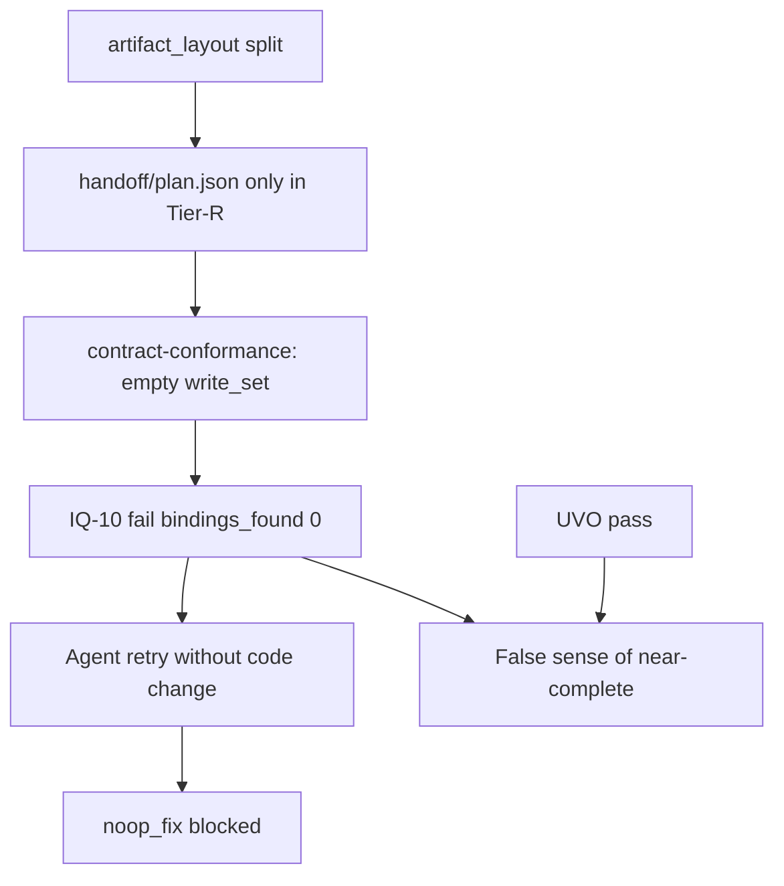

# RCA: jian-h5 CTB-44243 guazi-flow-goal 运行复盘

| Field | Value |
| --- | --- |
| Parent | [Wayfinder #1 — Goal 交付质量与全链路效率](https://github.com/sophiezel/goal/issues/1) |
| Research ticket | [#3](https://github.com/sophiezel/goal/issues/3) |
| Jira | CTB-44243 |
| Repo / branch | `jian-h5` / `CTB-44243-T1` |
| Task dir | `docs/guazi-flow/2026-07-31-疑似车商收车审批申请` |
| Pipeline state | `~/.goal-pipeline/state/projects/1115ca6039e1/CTB-44243-T1/2026-07-31-疑似车商收车审批申请/` |
| Run window (UTC) | 2026-07-31 11:36:05 — 12:09:05 (~33 min) |
| Final status | **blocked** (`failure_code`: `noop_fix`) |
| Stages reached | plan (post pass) → implement (post **fail**) — **no** quality / review / complete |

## Evidence sources

| Artifact | Path |
| --- | --- |
| State | `.../state.json` |
| Plan handoff (Tier-R) | `.../artifacts/handoff/plan.json` |
| Plan gate fix input (early) | `.../artifacts/evidence/plan-gate-fix-input.json` |
| Implement gate fix input (terminal) | `.../artifacts/evidence/implement-gate-fix-input.json` |
| UVO | `.../artifacts/evidence/verification-oracle.json` |
| IQ-10 | `.../artifacts/evidence/contract-conformance.json` |
| AM ratchet | `.../artifacts/evidence/acceptance-matrix-ratchet.json` |
| Timing | `.../artifacts/evidence/pipeline-timing.json` |
| Task index (repo) | `jian-h5/docs/guazi-flow/2026-07-31-疑似车商收车审批申请/index.md` |

---

## 1. Facts — what passed / failed

### 1.1 Plan (`gate --post plan`)

| Result | Detail |
| --- | --- |
| **Pass** | `state.json` → `gates.plan.post.exit_code: 0`, `passed_at: 2026-07-31T11:38:37Z` |
| Initial friction | `plan-gate-fix-input.json` captured an **earlier** failed attempt: **PQ-07** (blocker) — `src/pages` in write_set but no `build:beta` in index; plus PQ-08/09/10/14 warnings on acceptance matrix shape |
| After fix | Current `index.md` includes **V02** + `verify_command` with `CI=true yarn build:beta`; **## API 与工程映射** table present |

### 1.2 Implement (`gate --post implement`)

| Check | Result | Notes |
| --- | --- | --- |
| **UVO** (`verification-oracle.json`) | **pass** | `overall: pass`, ~23.5s; scope/secret/lint/tsc/related-tests pass; **build skipped** (UVO cache hit, same `code_subject_hash`) |
| **AM ratchet** | **pass** (`overall: pass`) | AM-07 **warning**: plan `write_set` lists non-repo paths (`/external/delivery/suspectedDealer/*`, `App.tsx`, `pages/index.ts` without `src/`) |
| **IQ-10** (`contract-conformance.json`) | **fail** | `bindings_found: 0`, two blockers: no `createRequest` binding for detail/apply paths |
| **Terminal block** | **noop_fix** | `implement-gate-fix-input.json`: G000 — `subject_hash` unchanged; `state.json` `blocked_at` immediately after UVO pass timestamp |

### 1.3 Not executed

- No `quality` / `review` / `complete` handoffs or evidence in Tier-R layout for this run.
- `index.md` front matter still shows `current_stage: implement` while body says **当前状态：plan** (stale narrative).

### 1.4 Reproduction note (2026-08-01 local)

Running `contract-conformance-check.py` against repo `task-dir` **without** `handoff/plan.json` in the repo reproduces `bindings_found: 0` and IQ-10 failure. Copying Tier-R `artifacts/handoff/plan.json` into `task-dir/handoff/` → **pass** (`bindings_found: 3`). This isolates the failure from “missing HTTP bindings” to **empty write_set resolution**.

---

## 2. Root cause — four planes

### 2.1 Control plane（编排 / 门禁 / 状态）

| ID | Symptom | Root cause | Severity |
| --- | --- | --- | --- |
| C-1 | IQ-10 blocks implement after UVO pass | **`contract-conformance-check.py` only reads `task_dir/handoff/plan.json`**. Under `artifact_layout.mode: split`, handoff lives in **Tier-R** (`GOAL_EVIDENCE_DIR` sibling `artifacts/handoff/`), not in repo task dir. `export GOAL_HANDOFF_DIR` is set in `implement.sh` but **not consumed** by IQ-10 (unlike `acceptance-matrix-ratchet.py` and `verification_oracle_core.py`). | **P0** |
| C-2 | Pipeline ends in `noop_fix` | After IQ-10 failure, agent re-ran implement post-gate without changing `code_subject_hash` → `gate-guazi-flow-stage.sh` `check_noop_ratchet` → `blocked_noop_fix`. Correct safety behavior; poor **causal ordering** in fix-input (terminal artifact shows G000, not IQ-10). | P1 |
| C-3 | `current_stage` / index narrative drift | Plan/implement gates do not fully reconcile index body + YAML `flow.current_stage` with state machine. | P2 |

### 2.2 Data plane（handoff / write_set / 路径）

| ID | Symptom | Root cause | Severity |
| --- | --- | --- | --- |
| D-1 | `plan.json` write_set pollution | Entries like `/external/delivery/suspectedDealer/*`, `App.tsx`, `pages/index.ts` (no `src/`) — API path mistaken for filesystem path; breaks AM-07 “paths in repo” heuristics. | P1 |
| D-2 | Split layout migration | `state.json` `artifact_layout.migrated_at` set; repo has **no** `handoff/plan.json` while Tier-R has canonical plan. Consumers inconsistent on which tier to read. | **P0** (with C-1) |
| D-3 | `contract-conformance.json` `profile: ""` | Empty write_set → profile never loaded from plan | P2 |

### 2.3 Quality plane（PQ / IQ / UVO / 验收）

| ID | Symptom | Root cause | Severity |
| --- | --- | --- | --- |
| Q-1 | PQ-07 on first plan attempt | Lite plan omitted explicit `build:beta` row until gate feedback — expected firewall behavior. | P2 (resolved in run) |
| Q-2 | PQ-08 warnings (many rows) | Lite acceptance rows used “验证” / free-text columns without `automated` / `verify_command` tokens PQ-08 expects. | P2 |
| Q-3 | IQ-10 “no binding” false positive | Primary: **no files scanned** (D-1/C-1). Secondary: jian-h5 idiom `const req = request.createRequest({ key }); req({ uri })` does not place `key`+`uri` in same `createRequest({})` window — `extract_h5_bindings` only matches co-located fields within ~800 chars. Repo later added `void [ request.createRequest({ key, uri }) ]` anchors (workaround). | P1 |
| Q-4 | UVO build step skipped | Cache hit on `code_subject_hash` — valid for efficiency; matrix **V02** not re-verified on this pass. | P3 |
| Q-5 | Delivery incomplete | Blocked before review/complete — feature code may be done locally but **pipeline did not certify** end-to-end. | P1 (outcome) |

### 2.4 Efficiency plane（重试 / 耗时）

| ID | Symptom | Root cause | Severity |
| --- | --- | --- | --- |
| E-1 | Implement stage **10+** `start` events (11:39–12:08 UTC) | Gate fail → fix loops (plan PQ, then implement IQ-10 / noop_fix); no fail-fast linking IQ-10 to handoff tier. | P1 |
| E-2 | Wall clock ~33 min for M-tier (SLO p50 45 min) | Within SLO but **front-loaded churn** on implement post-gate. | P2 |
| E-3 | Related-tests union ran **113** tests across 13 suites | UVO `related_union` — broader than task `testPathPattern` in index; acceptable safety, extra CI time (~8s). | P3 |

---

## 3. Causal chain (condensed)



---

## 4. Recommended spec / code changes (goal repo)

Priority ordered; each item names likely owner file/module.

| # | Change | Plane | Rationale |
| --- | --- | --- | --- |
| 1 | **`contract-conformance-check.py`**: resolve `plan.json` via `GOAL_HANDOFF_DIR` or `HANDOFF_DIR` when `task_dir/handoff/plan.json` missing — **same pattern as `acceptance-matrix-ratchet.py` L87–90** | Control + Data | Eliminates P0 false IQ-10 on split layout |
| 2 | **`four_planes_doctor` / split migration**: assert all implement post-gate scripts honor `GOAL_HANDOFF_DIR`; add eval fixture `split-handoff-iq10` | Control | Prevent regression |
| 3 | **Plan gate / `py_write_handoff`**: normalize write_set — reject leading `/external` API paths; require `src/` for app files; dedupe with index 写集 | Data | Fixes AM-07 noise and agent confusion |
| 4 | **`contract_parser.extract_h5_bindings`**: optional second pass for `createRequest({key})` + following `req({ uri })` call pattern (jian-h5 standard) | Quality | Reduces anchor hacks |
| 5 | **`gate_fail_with_issues` / fix-input**: when exiting `noop_fix`, retain **prior** failing issue ids (IQ-10) in `implement-gate-fix-input.json`, not only G000 | Control | Faster human/agent recovery |
| 6 | **PQ-08 lite profile**: document required column header (`verify_command` / `automated`) in `plan-quality-rules.json` + guazi-flow-plan template | Quality | Fewer warn storms on first plan |
| 7 | **UVO policy**: when index matrix mandates `build:beta` (V02), optionally **ratchet** build even on cache hit (tier strict) | Quality | Closes Q-4 gap |
| 8 | **`sync_index_current_stage`**: update index 概览「当前状态」not only YAML front matter | Control | C-3 |

---

## 5. jian-h5 task outcome (out of scope for goal merge, for context)

- Page + service + tests exist on branch; local UVO evidence shows green compile/test.
- Pipeline **did not** reach review/complete; MR should not claim guazi-flow-goal certification until implement post-gate passes with Tier-R handoff resolution fix (or temporary repo `handoff/plan.json` sync policy).

---

## 6. Verification commands used for this RCA

```bash
# IQ-10 without repo handoff (repro fail)
python3 goal-pipeline/scripts/contract-conformance-check.py \
  --task-dir "$JIAN_H5/docs/guazi-flow/2026-07-31-疑似车商收车审批申请" \
  --repo-root "$JIAN_H5" --json

# IQ-10 with handoff present (repro pass) — see §1.4
```

---

## 7. Related Wayfinder research

| Ticket | Link |
| --- | --- |
| #2 节点清单 | [pipeline-node-catalog.md](pipeline-node-catalog.md) — timing 缺口、smoke/quality 双轨 |
| #6 review-chain | [review-chain-bottlenecks.md](review-chain-bottlenecks.md) — 未跑到的 review 阶段预期瓶颈 |
| 合并大纲 v0 | [optimization-spec-outline-v0.md](optimization-spec-outline-v0.md) |
| #22 平面归因附录 | 本文 **§8**（回写自 [draft-zero-leakage-and-ux-policy.md](draft-zero-leakage-and-ux-policy.md)） |

---

## 8. Appendix — 平面归因与规格映射（#22）

**Purpose:** 将 CTB-44243 运行事实（§1–§3）映射到 Goal **五平面**（PQ / IQ / UVO / Control / UX）与 draft [#4/#5](https://github.com/sophiezel/goal/issues/4) 漏出分型；并链到 [optimization-spec-outline-v0.md](optimization-spec-outline-v0.md) P0/P1 与已落地 commit。**SSOT 仍是 §2 根因表**；本节为 HITL 收口后的「建议归属平面」，供后续 run 与 spec 审计使用。

**Ratification:** [issue #22](https://github.com/sophiezel/goal/issues/22)（2026-08-01）；closes draft open Q12。

### 8.1 五平面职责（本样本语境）

| 平面 | 阶段 / 脚本 | 本 run 职责 | CTB-44243 是否触及 |
| --- | --- | --- | --- |
| **PQ** | plan post · `plan-quality-gate.py` | 冻结 index 结构、写集、API 表、矩阵列头（PQ-01..14） | **是** — 首轮 PQ-07 block，修后 plan post pass |
| **IQ** | implement post · `contract-conformance-check.py` | 实现与 plan 契约绑定（IQ-10、`createRequest`↔uri） | **是** — 终端 **fail**（`bindings_found: 0`） |
| **UVO** | implement post · `verification_oracle_core.py` | 机器验证：scope/lint/tsc/related-tests/build（可 cache） | **是** — **pass**（build skipped on cache） |
| **Control** | `gate-guazi-flow-stage.sh`、state、handoff tier、noop ratchet | 编排顺序、fix-input、split layout SSOT | **是** — C-1/C-2 主因；`noop_fix` 终态 |
| **UX** | plan post L10 manifest · implement `ux-scan.json` | 双轨 UX 债（D1/D2/D5）；**非** IQ-10 契约 | **否（本 run）** — 未达 quality/review；骨架/按钮 loading 仅 **潜在** L10（见 §8.5） |

**关键次序（UVO vs IQ）：** implement post 内 UVO 与 IQ-10 **并行消费同一 handoff 根**（修复后 via `resolve_handoff_dir` / `GOAL_HANDOFF_DIR`）。本 run 在修复前 IQ-10 **未**读 Tier-R `plan.json` → 空 `write_set` → IQ fail，而 UVO 仍可对已提交 `src` **pass**（含 cache hit）。**不得**将 UVO pass 解读为「契约已绑定」或「接近 complete」——属 **控制面因果排序**问题（C-2 / G000 掩盖 IQ-10），非 UVO 漏检（L5 仅在 skip UVO 非法时成立）。

### 8.2 现象 → 平面 → 漏出分型 → 规格

| RCA / 现象 | 主责平面 | 闸门 / 证据 | 漏出分型 ([draft A.2](draft-zero-leakage-and-ux-policy.md)) | Spec（[v0](optimization-spec-outline-v0.md) / [v1](optimization-spec-outline-v1.md)） | 落地 |
| --- | --- | --- | --- | --- | --- |
| PQ-07 缺 `build:beta` | **PQ** | plan post | —（预期 firewall，非漏出） | PQ lite 写集规则 | 任务 index V02 已补 |
| PQ-08 矩阵列 warn | **PQ** | plan post | L2（若应拦未拦） | v0 P0 §6 PQ-08 文档化 | 模板 / plan-quality-rules |
| IQ-10 `bindings_found: 0` | **IQ** + **Control** + **Data** | `contract-conformance.json` | **L3** plan–implement 漂移（实为 handoff 读错） | v0 **P0 §1** Handoff SSOT · [v1 Part D](optimization-spec-outline-v1.md) PQ/IQ 分层 | **`d9bf079`** · [#14](https://github.com/sophiezel/goal/issues/14) `df887b4`/`041b63b` · [#17](https://github.com/sophiezel/goal/issues/17) `649abae` |
| UVO pass，build skipped | **UVO** | `verification-oracle.json` | 非 L5（合法 cache）；**效率/严格度**议题 | v0 RCA §4 #7（可选 build ratchet）· **defer** | — |
| AM-07 write_set 路径噪声 | **Data** + **PQ** | `acceptance-matrix-ratchet.json` | L4 边缘（warn） | v0 **P0 §2** `normalize_write_set` | plan post `plan.json` |
| `noop_fix` / G000 终态 | **Control** | `implement-gate-fix-input.json` | **L7** 无效修复循环 | v0 **P0 §3** noop 因果链 | `a80798a` 等 — 实质 blocker 优先于 G000 |
| 11× implement `start` | **Control** + 效率 | `pipeline-timing.json` | — | v0 P1 §12 timing · [#9](https://github.com/sophiezel/goal/issues/9) | `ee1ef04` |
| `createRequest` 分步写法误报 | **IQ** | IQ-10 提取器 | L3（真漂移时） | v0 **P2 §15** factory+uri 第二遍 | `contract_parser.extract_h5_bindings` |
| quality / review / complete 未跑 | **Control** | state `blocked` | L6/L8 **未触发**（管线未宣称通过） | review [#6](https://github.com/sophiezel/goal/issues/6) · [#23](https://github.com/sophiezel/goal/issues/23) | `fd9fdf9` |
| index `current_stage` 叙事漂移 | **Control** | index body vs YAML | — | RCA §4 #8 · **defer** | — |

### 8.3 IQ-10 handoff 归因链（Control + Data）

```text
artifact_layout=split
  → plan.json SSOT 在 Tier-R (GOAL_EVIDENCE_DIR/artifacts/handoff/)
  → IQ-10 仅读 task_dir/handoff/plan.json（修复前）
  → write_set=[] → bindings_found=0
  → Agent 重试 implement post 无 code 变更
  → check_noop_ratchet → noop_fix (G000 写入 fix-input，掩盖 IQ-10)
```

**修复后验证：** [iq10-handoff-fix-run-log.md](iq10-handoff-fix-run-log.md) — 同任务 `implement/post` exit 0，`bindings_found: 3`。

**与 [#15](https://github.com/sophiezel/goal/issues/15) PQ/IQ 分层：** PQ-10 API 表在 plan 已 **pass** 后，IQ-10 对同一契约键仍应 **hard**；本样本 IQ fail **不是** PQ/IQ 重复 double-block，而是 **数据面 handoff 根不一致**（dedupe 不适用）。

### 8.4 noop_fix vs IQ-10（Control）

| 项 | 归属 | 说明 |
| --- | --- | --- |
| `subject_hash` 不变重跑 gate | **Control** · L7 | 安全行为正确；fix-input 应保留 **上轮 IQ-10** id，避免仅见 G000 |
| 误以为「再跑一遍 gate 就好」 | **效率** + Control | E-1；timing 子步骤可观测 |
| 清除 stale fix-input 后重试 | **运维** | run log §D — 非产品缺陷 |

### 8.5 UX 平面（本 run 未执行闸门；draft #5 归属）

| 潜在 UX 议题 | 平面 | 本任务 scope | 漏出 / 策略 |
| --- | --- | --- | --- |
| 骨架屏 / 首屏 loading | **UX** · UX-D1 | 若 **未** 写 `ui.loading[]` / 矩阵 C# | **非 W2 L9**；review 软检或 L10 manifest（[#11](https://github.com/sophiezel/goal/issues/11) `ux-scan` warn） |
| 审批按钮 in-flight | **UX** · UX-D2 | write_set 内页 | 可 D2 narrow auto-fix（C1）；**非 IQ-10** |
| `viewingResults` 带看页 | **scope** | README / index out-of-scope | **不算**本任务漏出（draft B.1） |
| fe-argus L10 @ plan post | **UX** · plan | 本 run plan post 曾 pass | v1 rule manifest · skill ② → [#8](https://github.com/sophiezel/goal/issues/8) defer |

### 8.6 jian-h5 交叉引用（只读）

- 任务目录：`jian-h5/docs/guazi-flow/2026-07-31-疑似车商收车审批申请/`（**非** goal 合并范围）。
- 分支 `CTB-44243-T1`：实现可能存在；**guazi-flow-goal 认证**以 implement post pass + 后续 review/complete 为准（§5）。

---

*Generated for Wayfinder research #3. Research asset only — does not close product delivery for CTB-44243. §8 added via #22 (2026-08-01).*
