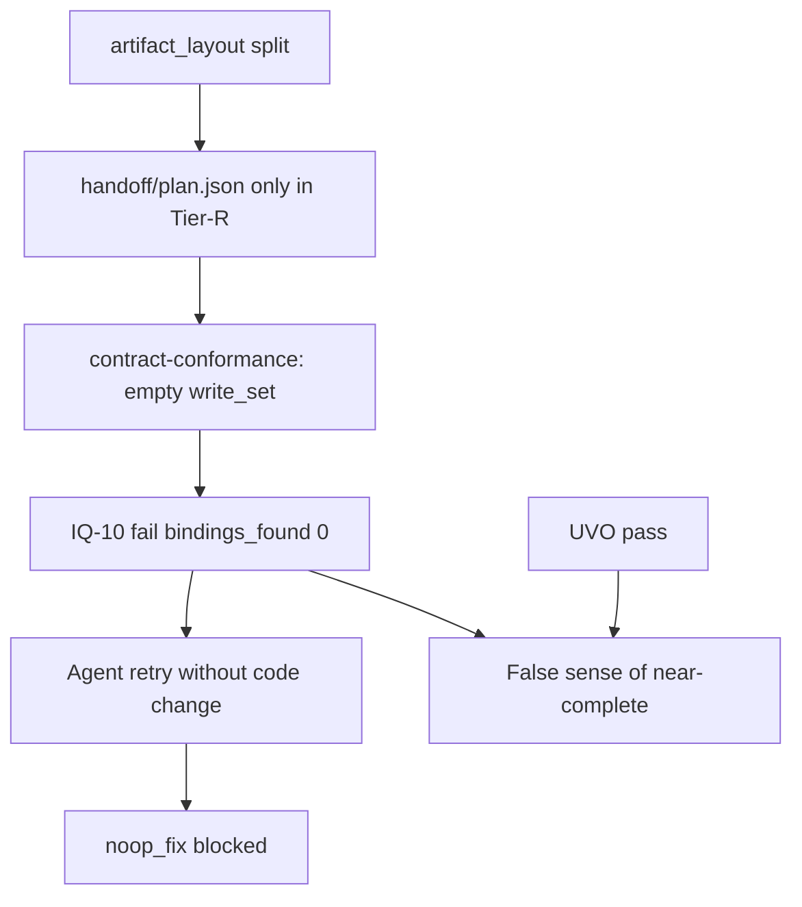

# RCA: jian-h5 CTB-44243 guazi-flow-goal 运行复盘

| Field | Value |
| --- | --- |
| Parent | [Wayfinder #1 — Goal 交付质量与全链路效率](https://github.com/sophiezel/goal/issues/1) |
| Research ticket | [#3](https://github.com/sophiezel/goal/issues/3) |
| Jira | CTB-44243 |
| Repo / branch | `jian-h5` / `CTB-44243-T1` |
| Task dir | `docs/guazi-flow/2026-07-31-疑似车商收车审批申请` |
| Pipeline state | `~/.goal-pipeline/state/projects/1115ca6039e1/CTB-44243-T1/2026-07-31-疑似车商收车审批申请/` |
| Run window (UTC) | 2026-07-31 11:36:05 — 12:09:05 (~33 min) |
| Final status | **blocked** (`failure_code`: `noop_fix`) |
| Stages reached | plan (post pass) → implement (post **fail**) — **no** quality / review / complete |

## Evidence sources

| Artifact | Path |
| --- | --- |
| State | `.../state.json` |
| Plan handoff (Tier-R) | `.../artifacts/handoff/plan.json` |
| Plan gate fix input (early) | `.../artifacts/evidence/plan-gate-fix-input.json` |
| Implement gate fix input (terminal) | `.../artifacts/evidence/implement-gate-fix-input.json` |
| UVO | `.../artifacts/evidence/verification-oracle.json` |
| IQ-10 | `.../artifacts/evidence/contract-conformance.json` |
| AM ratchet | `.../artifacts/evidence/acceptance-matrix-ratchet.json` |
| Timing | `.../artifacts/evidence/pipeline-timing.json` |
| Task index (repo) | `jian-h5/docs/guazi-flow/2026-07-31-疑似车商收车审批申请/index.md` |

---

## 1. Facts — what passed / failed

### 1.1 Plan (`gate --post plan`)

| Result | Detail |
| --- | --- |
| **Pass** | `state.json` → `gates.plan.post.exit_code: 0`, `passed_at: 2026-07-31T11:38:37Z` |
| Initial friction | `plan-gate-fix-input.json` captured an **earlier** failed attempt: **PQ-07** (blocker) — `src/pages` in write_set but no `build:beta` in index; plus PQ-08/09/10/14 warnings on acceptance matrix shape |
| After fix | Current `index.md` includes **V02** + `verify_command` with `CI=true yarn build:beta`; **## API 与工程映射** table present |

### 1.2 Implement (`gate --post implement`)

| Check | Result | Notes |
| --- | --- | --- |
| **UVO** (`verification-oracle.json`) | **pass** | `overall: pass`, ~23.5s; scope/secret/lint/tsc/related-tests pass; **build skipped** (UVO cache hit, same `code_subject_hash`) |
| **AM ratchet** | **pass** (`overall: pass`) | AM-07 **warning**: plan `write_set` lists non-repo paths (`/external/delivery/suspectedDealer/*`, `App.tsx`, `pages/index.ts` without `src/`) |
| **IQ-10** (`contract-conformance.json`) | **fail** | `bindings_found: 0`, two blockers: no `createRequest` binding for detail/apply paths |
| **Terminal block** | **noop_fix** | `implement-gate-fix-input.json`: G000 — `subject_hash` unchanged; `state.json` `blocked_at` immediately after UVO pass timestamp |

### 1.3 Not executed

- No `quality` / `review` / `complete` handoffs or evidence in Tier-R layout for this run.
- `index.md` front matter still shows `current_stage: implement` while body says **当前状态：plan** (stale narrative).

### 1.4 Reproduction note (2026-08-01 local)

Running `contract-conformance-check.py` against repo `task-dir` **without** `handoff/plan.json` in the repo reproduces `bindings_found: 0` and IQ-10 failure. Copying Tier-R `artifacts/handoff/plan.json` into `task-dir/handoff/` → **pass** (`bindings_found: 3`). This isolates the failure from “missing HTTP bindings” to **empty write_set resolution**.

---

## 2. Root cause — four planes

### 2.1 Control plane（编排 / 门禁 / 状态）

| ID | Symptom | Root cause | Severity |
| --- | --- | --- | --- |
| C-1 | IQ-10 blocks implement after UVO pass | **`contract-conformance-check.py` only reads `task_dir/handoff/plan.json`**. Under `artifact_layout.mode: split`, handoff lives in **Tier-R** (`GOAL_EVIDENCE_DIR` sibling `artifacts/handoff/`), not in repo task dir. `export GOAL_HANDOFF_DIR` is set in `implement.sh` but **not consumed** by IQ-10 (unlike `acceptance-matrix-ratchet.py` and `verification_oracle_core.py`). | **P0** |
| C-2 | Pipeline ends in `noop_fix` | After IQ-10 failure, agent re-ran implement post-gate without changing `code_subject_hash` → `gate-guazi-flow-stage.sh` `check_noop_ratchet` → `blocked_noop_fix`. Correct safety behavior; poor **causal ordering** in fix-input (terminal artifact shows G000, not IQ-10). | P1 |
| C-3 | `current_stage` / index narrative drift | Plan/implement gates do not fully reconcile index body + YAML `flow.current_stage` with state machine. | P2 |

### 2.2 Data plane（handoff / write_set / 路径）

| ID | Symptom | Root cause | Severity |
| --- | --- | --- | --- |
| D-1 | `plan.json` write_set pollution | Entries like `/external/delivery/suspectedDealer/*`, `App.tsx`, `pages/index.ts` (no `src/`) — API path mistaken for filesystem path; breaks AM-07 “paths in repo” heuristics. | P1 |
| D-2 | Split layout migration | `state.json` `artifact_layout.migrated_at` set; repo has **no** `handoff/plan.json` while Tier-R has canonical plan. Consumers inconsistent on which tier to read. | **P0** (with C-1) |
| D-3 | `contract-conformance.json` `profile: ""` | Empty write_set → profile never loaded from plan | P2 |

### 2.3 Quality plane（PQ / IQ / UVO / 验收）

| ID | Symptom | Root cause | Severity |
| --- | --- | --- | --- |
| Q-1 | PQ-07 on first plan attempt | Lite plan omitted explicit `build:beta` row until gate feedback — expected firewall behavior. | P2 (resolved in run) |
| Q-2 | PQ-08 warnings (many rows) | Lite acceptance rows used “验证” / free-text columns without `automated` / `verify_command` tokens PQ-08 expects. | P2 |
| Q-3 | IQ-10 “no binding” false positive | Primary: **no files scanned** (D-1/C-1). Secondary: jian-h5 idiom `const req = request.createRequest({ key }); req({ uri })` does not place `key`+`uri` in same `createRequest({})` window — `extract_h5_bindings` only matches co-located fields within ~800 chars. Repo later added `void [ request.createRequest({ key, uri }) ]` anchors (workaround). | P1 |
| Q-4 | UVO build step skipped | Cache hit on `code_subject_hash` — valid for efficiency; matrix **V02** not re-verified on this pass. | P3 |
| Q-5 | Delivery incomplete | Blocked before review/complete — feature code may be done locally but **pipeline did not certify** end-to-end. | P1 (outcome) |

### 2.4 Efficiency plane（重试 / 耗时）

| ID | Symptom | Root cause | Severity |
| --- | --- | --- | --- |
| E-1 | Implement stage **10+** `start` events (11:39–12:08 UTC) | Gate fail → fix loops (plan PQ, then implement IQ-10 / noop_fix); no fail-fast linking IQ-10 to handoff tier. | P1 |
| E-2 | Wall clock ~33 min for M-tier (SLO p50 45 min) | Within SLO but **front-loaded churn** on implement post-gate. | P2 |
| E-3 | Related-tests union ran **113** tests across 13 suites | UVO `related_union` — broader than task `testPathPattern` in index; acceptable safety, extra CI time (~8s). | P3 |

---

## 3. Causal chain (condensed)



---

## 4. Recommended spec / code changes (goal repo)

Priority ordered; each item names likely owner file/module.

| # | Change | Plane | Rationale |
| --- | --- | --- | --- |
| 1 | **`contract-conformance-check.py`**: resolve `plan.json` via `GOAL_HANDOFF_DIR` or `HANDOFF_DIR` when `task_dir/handoff/plan.json` missing — **same pattern as `acceptance-matrix-ratchet.py` L87–90** | Control + Data | Eliminates P0 false IQ-10 on split layout |
| 2 | **`four_planes_doctor` / split migration**: assert all implement post-gate scripts honor `GOAL_HANDOFF_DIR`; add eval fixture `split-handoff-iq10` | Control | Prevent regression |
| 3 | **Plan gate / `py_write_handoff`**: normalize write_set — reject leading `/external` API paths; require `src/` for app files; dedupe with index 写集 | Data | Fixes AM-07 noise and agent confusion |
| 4 | **`contract_parser.extract_h5_bindings`**: optional second pass for `createRequest({key})` + following `req({ uri })` call pattern (jian-h5 standard) | Quality | Reduces anchor hacks |
| 5 | **`gate_fail_with_issues` / fix-input**: when exiting `noop_fix`, retain **prior** failing issue ids (IQ-10) in `implement-gate-fix-input.json`, not only G000 | Control | Faster human/agent recovery |
| 6 | **PQ-08 lite profile**: document required column header (`verify_command` / `automated`) in `plan-quality-rules.json` + guazi-flow-plan template | Quality | Fewer warn storms on first plan |
| 7 | **UVO policy**: when index matrix mandates `build:beta` (V02), optionally **ratchet** build even on cache hit (tier strict) | Quality | Closes Q-4 gap |
| 8 | **`sync_index_current_stage`**: update index 概览「当前状态」not only YAML front matter | Control | C-3 |

---

## 5. jian-h5 task outcome (out of scope for goal merge, for context)

- Page + service + tests exist on branch; local UVO evidence shows green compile/test.
- Pipeline **did not** reach review/complete; MR should not claim guazi-flow-goal certification until implement post-gate passes with Tier-R handoff resolution fix (or temporary repo `handoff/plan.json` sync policy).

---

## 6. Verification commands used for this RCA

```bash
# IQ-10 without repo handoff (repro fail)
python3 goal-pipeline/scripts/contract-conformance-check.py \
  --task-dir "$JIAN_H5/docs/guazi-flow/2026-07-31-疑似车商收车审批申请" \
  --repo-root "$JIAN_H5" --json

# IQ-10 with handoff present (repro pass) — see §1.4
```

---

## 7. Related Wayfinder research

| Ticket | Link |
| --- | --- |
| #2 节点清单 | [pipeline-node-catalog.md](pipeline-node-catalog.md) — timing 缺口、smoke/quality 双轨 |
| #6 review-chain | [review-chain-bottlenecks.md](review-chain-bottlenecks.md) — 未跑到的 review 阶段预期瓶颈 |
| 合并大纲 v0 | [optimization-spec-outline-v0.md](optimization-spec-outline-v0.md) |

---

*Generated for Wayfinder research #3. Research asset only — does not close product delivery for CTB-44243.*
