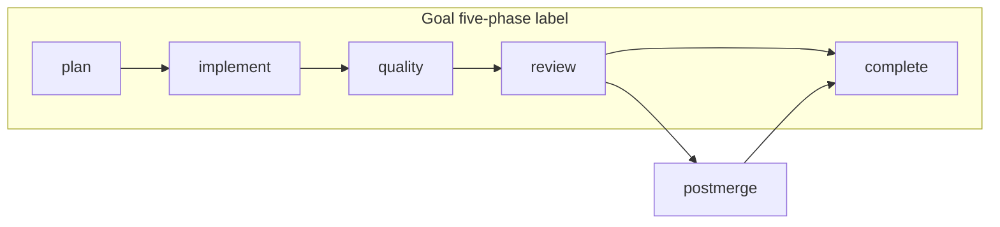

# postmerge ↔ complete plane handoff (#18)

Parent: [Wayfinder #1](https://github.com/sophiezel/goal/issues/1). SSOT: [`postmerge-complete-evidence.md`](../../goal-pipeline/references/postmerge-complete-evidence.md), [`guazi-flow-integration.md`](../../guazi-flow-goal/references/guazi-flow-integration.md), [`failure-code-dictionary.md`](../../goal-pipeline/references/failure-code-dictionary.md).

## Purpose

`guazi-flow-postmerge` sits **outside** the Goal five-phase label (`plan → implement → quality → review → complete`) but **inside** the Guazi Flow delivery chain when `resolved_rule_context.postmerge_policy = required`. Goal must route `goal-advance-stage` / `goal-stage-driver` through postmerge before complete, and **`quality_plane_check --mode complete`** must fail closed with `postmerge_required` when policy is required but `evidence/postmerge.md` is missing or not `pass`.

## Orchestration (Goal vs Guazi Flow)



| Layer | Review pass → complete path |
|-------|------------------------------|
| **Guazi Flow** | `review` → (`postmerge` if required) → `guazi-flow-complete` |
| **goal-advance-stage** | `next_stage=postmerge` when policy required and evidence missing; else `complete` |
| **goal-stage-driver** | `skill_to_load=guazi-flow-postmerge`, progress `[postmerge] delivery` |
| **complete gate** | `gate-lib/complete.sh` → `quality_plane_check --mode complete` (includes postmerge) |

Policy resolution: `goal-pipeline/scripts/resolve_postmerge_policy.py` (env `GOAL_POSTMERGE_POLICY` → `state.resolved_rule_context` → `handoff/plan.json` → `index.md` frontmatter → default `optional`).

## W1 / W2 bookkeeping

| Window | postmerge |
|--------|-----------|
| **W1** (single run) | `postmerge_required` at complete when policy `required` and postmerge evidence not `pass` + fresh `review_subject_hash`; blocks `quality_plane_check` and therefore `gate --post complete` / `--assert-complete`. |
| **W2** (MR / matrix) | Postmerge does **not** add `matrix_rows_unsatisfied`; Jira/MR delivery gaps are **delivery plane** (`delivery_evidence_missing`, Git gate) — document in MR checklist, not W2 matrix leakage. |

## Fixture

```bash
goal-pipeline/scripts/fixtures/guazi-flow-gate/test-quality-plane-postmerge.sh
```

Bundled in `run-all-gate-tests.sh`.

## Cross-refs

- Complete path quality plane: [`pipeline-node-catalog.md`](pipeline-node-catalog.md) (`quality_plane_check` non-skippable).
- Evidence checklist: [`postmerge-complete-evidence.md`](../../goal-pipeline/references/postmerge-complete-evidence.md).
