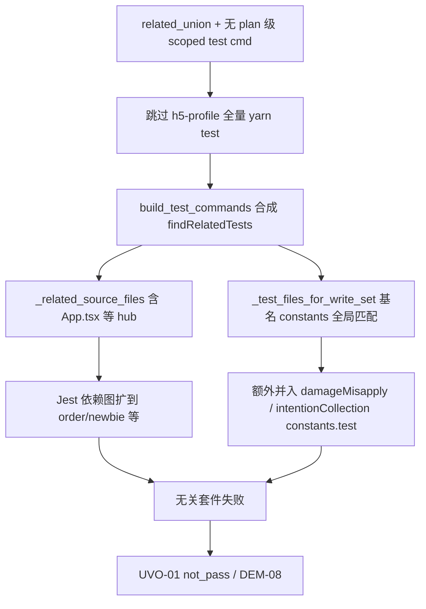

# UVO-01 归因与 goal 侧修复选项矩阵（CTB-44243 `260728-*`）

**Status:** Research closure for [Wayfinder #25](https://github.com/sophiezel/goal/issues/25)  
**Parent map:** [Wayfinder #24 — Phase-4 全链路硬化](https://github.com/sophiezel/goal/issues/24)  
**规格输入:** [phase-4-layered-demand-and-slo-input.md](phase-4-layered-demand-and-slo-input.md)（DEM-08 / SLO-Q-01）  
**夹具验收:** [#30](https://github.com/sophiezel/goal/issues/30)（goal 实现合入后复跑）

**结论（可验证）：** 本 run 的 UVO-01 **不是** `suspectedDealerCollectApproval` 实现缺陷导致的 block，而是 **R3 DEM-08（验证范围过宽 / 误拦）**：`related_union` 下 `build_test_commands` 合成的 `yarn test --findRelatedTests` 目标集过宽，Jest 执行了与 write_set 弱相关甚至无关的套件（含 `order/newbie`），失败用例 **不在** 任务变更闭包内。`implement-gate-fix-input.json` 的 `root_cause=implement_qc` 仅为粗粒度桶，**应细分为 oracle 政策（DEM-08）**。

---

## 1. 证据锚点

| 工件 | 路径 |
|------|------|
| UVO | `~/.goal-pipeline/state/projects/1115ca6039e1/CTB-44243-T1/260728-疑似车商车源收车审批/artifacts/evidence/verification-oracle.json` |
| Implement fix-input | `.../implement-gate-fix-input.json` |
| Handoff plan | `.../artifacts/handoff/plan.json` |
| 代码 SSOT | `goal-pipeline/scripts/verification_oracle_core.py` · `resolve_verification_commands.py` |

### 1.1 Gate 表面症状

- `overall`: **not_pass**
- `oracle_mode`: **related_union**
- 失败 step: **`test:related-tests`**（`exit_code: 1`）
- `implement-gate-fix-input.json`: **UVO-01**, `root_cause: implement_qc`

### 1.2 实际执行的测试命令（摘录）

`verification-oracle.json` → `steps[id=test:related-tests].cmd`：

```text
CI=true yarn test --findRelatedTests \
  "src/App.tsx" "src/config/env.js" "src/pages/index.ts" \
  "src/pages/suspectedDealerCollectApproval/..." \
  "src/App.test.tsx" \
  "src/pages/suspectedDealerCollectApproval/constants.test.ts" \
  "src/pages/damageMisapply/constants.test.ts" \
  "src/pages/intentionCollection/constants.test.ts" \
  --watchAll=false --maxWorkers=50%
```

Jest 摘要（同文件 `output_tail`）：

- **33 of 34** suites 被选中；**5 failed**（6 tests）
- 可见失败栈：`src/pages/order/newbie/list/index.test.tsx:249`（「创建考试」按钮未找到）
- 与 write_set 页面 `suspectedDealerCollectApproval` **无路径交集**

### 1.3 write_set（handoff `plan.json`）

- 核心：`src/pages/suspectedDealerCollectApproval/**`、`src/services/suspectedDealerCollectApproval.ts`
- 共享入口（M-tier 信号 `touches_shared_entry`）：`src/App.tsx`、`src/pages/index.ts`、`src/App.test.tsx`
- `verification`: `{}`；**无** `verification_commands` / `testPathPattern` 声明

---

## 2. 因果链（profile 无关）



### 2.1 机制 A：`resolve_verification_commands` + `related_union` 过滤

1. `resolve_verification_commands`（`touches_pages=true`）注入 h5 profile 命令：`CI=true yarn test --watchAll=false`（**无** `--findRelatedTests`）。
2. `build_test_commands` 在 `oracle_mode != full_suite` 时 **丢弃** 带 `watchAll=false` 且 **不含** `--findRelatedTests` 的 test 命令（`verification_oracle_core.py` L246–247）。
3. `plan.json` 无 `verification_commands` → `has_plan_test` 为 false → 走 **合成** `related-tests` 分支。

**可复现核对：** 对夹具 `task-dir` + `jian-h5` `repo-root` 运行 `resolve_verification_commands.py --json`，可见 profile 全量 test 被 UVO 层过滤；最终 oracle 仅保留 `findRelatedTests` 路径。

### 2.2 机制 B：`_test_files_for_write_set` 的 `constants` 基名碰撞

实现（`verification_oracle_core.py` L199–218）：

- 从 **所有** `changed_files` 下 `src/**` 路径收集 `os.path.basename` 无扩展名集合（含 `constants.ts` → **`constants`**）。
- 在 **整仓** `os.walk` 中，凡 `*.test.ts(x)` 的文件名经 `stem` 规则得到 **`constants`** 即入集。

因此 write_set 内 **单个** `constants.ts` 会把 **任意目录** 下的 `constants.test.ts` 并入目标，夹具中表现为：

- `src/pages/damageMisapply/constants.test.ts`
- `src/pages/intentionCollection/constants.test.ts`

二者 **不在** write_set 目录闭包内，属于 **显式误扩**（非 Jest 图遍历）。

### 2.3 机制 C：`App.tsx` 作为 `findRelatedTests` 种子 → hub 扩集

- `_related_source_files` 将 write_set 内的 `src/App.tsx` 列入 `findRelatedTests` 种子。
- Jest `--findRelatedTests` 对应用根组件做 **依赖反向闭包**，在 monolithic 路由仓中常扩到 **大量** 页面套件（本 run：`order/newbie` 等）。

`App.test.tsx` 已在 write_set 且已作为种子之一；**再对 `App.tsx` 做 findRelatedTests** 在语义上更接近「全仓相关」，与 **任务级 write_set** 不对齐。

### 2.4 任务实现是否「真红」？

- 同次 UVO：**scope / secret / lint / typecheck 均 pass**。
- 失败集中在 **非 write_set** 路径的既有套件。
- **反事实：** 若测试命令仅包含 `suspectedDealerCollectApproval` 闭包内源文件 + 同目录测试 + `App.test.tsx`，无证据表明本任务引入回归（需 [#30](https://github.com/sophiezel/goal/issues/30) 在 goal 修复后 **实测** 确认）。

**分层归类：** R3 **DEM-08**（primary）；非 R2 契约缺失、非 AM/IQ 类问题。

---

## 3. 对质量面 / SLO 的影响

| 面 | 影响 |
|----|------|
| **W1 漏出** | 本次为 **误拦**，不增加 silent pass；修复 DEM-08 **降低**「实现已完成却被无关红测 block」的交付摩擦。 |
| **W2 矩阵** | run 未过 implement post → 无 complete 漏出记账；与 UVO-01 无直接 W2 漏出。 |
| **SLO-Q-01（误拦率）** | 本夹具为 **高误拦样本**（失败用例 ∩ write_set 相关闭包 = ∅）；goal 修复后应用同一 oracle JSON 结构回算分子/分母。 |
| **SLO-E-01/E-02** | 33 suite ~10s；相对全量可接受，但 **无效套件仍消耗** implement post 墙钟。 |
| **Agent 行为** | fix-input 提示「在 write_set 内改代码」对 DEM-08 **误导**，易触发无效重试（关联 SLO-R-01 noop_fix）。 |

---

## 4. goal 侧修复选项矩阵（主路线）

评分：**推荐度** 1–5；**实现面** = 主要改动模块。

| ID | 选项 | 行为摘要 | 推荐 | 实现面 | 风险 / 权衡 |
|----|------|----------|------|--------|-------------|
| **G1** | **同目录配对测试**（收紧 `_test_files_for_write_set`） | 仅当 `foo.ts` 与 `foo.test.ts` **同目录**（或 write_set 目录树下）才并入；禁止整仓 `constants` 基名匹配 | **5** | `verification_oracle_core.py` | 极低漏拦：同目录 constants 仍覆盖；消除跨页 `constants.test` 误并 |
| **G2** | **Hub 种子策略**（`App.tsx` / `pages/index.ts`） | 默认：`findRelatedTests` **不**以 hub 源文件为种子；仅保留 hub 的 **显式** `*.test.tsx`（如 `App.test.tsx`）及 write_set 目录内源文件 | **5** | `verification_oracle_core.py` + 文档 | 需规格化「共享入口」列表（可复用 `resolve_verification_commands.H5_PAGE_PATTERNS`）；极端路由回归靠 matrix 声明命令或 quality smoke |
| **G3** | **write_set 路径闭包优先** | `targets = related_source(write_set∩changed) + colocated_tests(write_set)`；`changed_files` 仅作 AM/scope，不扩大 basename 扫描范围 | **4** | `verification_oracle_core.py` | 与 G1/G2 组合最佳；单独使用仍可能保留 hub 问题 |
| **G4** | **index / plan `verification.test_pattern` 或矩阵 `verify_command`** | 任务声明 scoped jest 命令时，`related_union` **不**再合成宽 `findRelatedTests`（`has_plan_test` 早返回） | **4** | `verification_oracle_core.py` + plan PQ 模板 | 依赖契约纪律；无声明时仍须 G1–G3 默认 |
| **G5** | **Oracle 输出 DEM-08 诊断** | `verification-oracle.json` 增加 `failing_test_files` / `out_of_write_set_closure`；implement QC 在闭包外失败时 `failure_code` 区分 `verification_scope_overreach` | **4** | `verification_oracle_core.py` + `implement-qc-gate.py` + `failure-codes.json` | 不自动 pass；改善 Agent 与 SLO-Q-01 计量 |
| **G6** | **Env / plan 逃逸（opt-in 宽集）** | `GOAL_UVO_RELATED_UNION_MODE=write_set_closure`（默认）vs `legacy_wide`；hub 扩集须 index 显式 `uvo_hub_expansion: true` | **3** | 同上 + guazi-flow-core profile | 兼容旧行为过渡期；默认须窄 |
| **G7** | **related_union 保留 profile test 但强制 findRelatedTests 参数化** | 将 h5 profile 全量 test 改写为带 `--findRelatedTests <write_set_closure>` 而非丢弃 | **3** | `build_test_commands` + resolver | 与 G2 重复度高；需统一命令 SSOT |

**推荐合入 bundle（实现票默认 AC）：** **G1 + G2 + G5**（必要）；**G4** 作为任务契约增强；**G6** 仅在需要兼容窗口时启用。

**建议单测 / fixture：**

- 扩展 `goal-pipeline/scripts/fixtures/guazi-flow-gate/test-verification-oracle.sh`：模拟多目录 `constants.test.ts`，断言 **仅** write_set 树下入集。
- 夹具 replay：`260728` state → 合成 cmd **不得**包含 `damageMisapply` / `intentionCollection` constants.test；**不得**在失败时仅因 `order/newbie` 路径失败（[#30](https://github.com/sophiezel/goal/issues/30)）。

---

## 5. 非主路线 / 反模式（否决作为地图交付）

| ID | 选项 | 为何否决 |
|----|------|----------|
| **X1** | 修 jian-h5 `order/newbie` 等既有红测 | 失败不在 write_set；仅为单票假绿（[#24](https://github.com/sophiezel/goal/issues/24) / [#26](https://github.com/sophiezel/goal/issues/26)） |
| **X2** | `index.md` 收窄 `testPathPattern` 仅跑本页 | 绕过 oracle 根因；他任务仍 DEM-08 |
| **X3** | skip UVO / 降级 `oracle_mode` | 破坏 R3；W1 漏出风险 |
| **X4** | 在 jian-h5 改 Jest 配置缩小 `findRelatedTests` 图 | 业务仓 one-off；违反 profile 无关 |

---

## 6. 决策摘要（供 #24 Decisions）

1. **UVO-01 根因：** DEM-08 — `related_union` 合成 `findRelatedTests` 时 **hub（App.tsx）+ 全局 constants 基名匹配** 导致验证范围远超 write_set。
2. **主修复：** goal-pipeline **`verification_oracle_core.py`**（G1+G2+G5）；验收 [#30](https://github.com/sophiezel/goal/issues/30)。
3. **规格默认（闭合 #28 开放项）：** write_set 闭包优先；hub 扩集 **opt-in**；与 [phase-4-layered-demand-and-slo-input.md §4](phase-4-layered-demand-and-slo-input.md) UVO `related_union` 行一致。

---

## 7. 引用代码位置

`_test_files_for_write_set` 与 `build_test_commands` 合成逻辑：

```199:296:goal-pipeline/scripts/verification_oracle_core.py
def _test_files_for_write_set(changed_files: list[str], repo_root: str) -> list[str]:
    ...
    basenames = {os.path.splitext(os.path.basename(f))[0] for f in code_changed}
    ...
            if stem in basenames:
                ...
    related = _related_source_files(changed_files, write_set)
    extra_tests = _test_files_for_write_set(changed_files, repo_root)
    targets = list(dict.fromkeys(related + extra_tests))
    ...
    "cmd": f"CI=true yarn test --findRelatedTests {joined} --watchAll=false",
```

`related_union` 过滤 profile 全量 test：

```245:272:goal-pipeline/scripts/verification_oracle_core.py
                if oracle_mode != "full_suite" and "watchAll=false" in cmd and "--findRelatedTests" not in cmd:
                    continue
    ...
    if has_plan_test:
        return _dedupe_commands(cmds)
```
